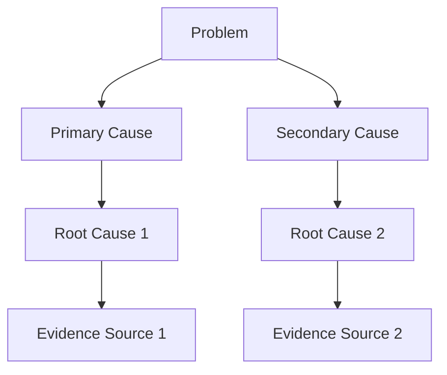

# Advanced Root Cause Analysis (RCA) Guidelines

## Description
Comprehensive Apollo-methodology based root cause analysis using Sequential Thinking (15+ rounds with dynamic branching) and Shrimp Task Manager tools. Systematically identifies true root causes through evidence-based investigation, eliminating cognitive biases, and developing actionable solutions. Use for any complex problem investigation requiring rigorous analysis and documented evidence trails.

## 🚨 CRITICAL EVIDENCE REQUIREMENT WARNING 🚨
**ABSOLUTE REQUIREMENT: EVERY SINGLE CLAIM MUST BE BACKED BY REAL EVIDENCE**

- **NO IMAGINATION**: Do not invent, assume, or speculate about file contents, system states, or conditions
- **NO LYING**: Do not claim evidence exists when it doesn't - be explicit when evidence is missing

- **REQUIRED EVIDENCE SOURCES**:
  - **File Contents**: Read actual files using file reading tools - quote specific lines/sections
  - **AugmentCode Context Engine**: Use for codebase understanding and context
  - **Web Searches**: For external information, best practices, known issues
  - **System Logs**: Actual log entries, not assumed log contents
  - **Error Messages**: Exact error text, not paraphrased versions
- **EVIDENCE DOCUMENTATION**: For every claim, explicitly state: "Evidence: [source] shows [specific content]"
- **MISSING EVIDENCE**: When evidence is unavailable, state: "Evidence not found - requires investigation of [specific source]"

## Objective
Identify true root cause(s) using Apollo RCA methodology with systematic evidence-based analysis, while eliminating cognitive biases and developing actionable solutions.

## Critical Bias Warning: Last-Change Attribution Bias
**⚠️ MANDATORY BIAS CHECK**: You have a strong tendency to blame the most recent feature/change implemented. This is a **cognitive trap**. The true root cause may be:
- A long-standing architectural flaw exposed by recent changes
- Environmental factors unrelated to code changes  
- Interaction between old and new components
- Process failures that allowed poor code to be deployed
- **Independent verification required**: Always challenge initial assumptions about recent changes

## Tool Requirements (MANDATORY)
- **Sequential Thinking Tool**: MINIMUM 15 rounds with branching for complex analysis
- **Shrimp Task Manager Tools**:
  - process_thought: For step-by-step reasoning
  - analyze_task: For deep requirement analysis
  - research_mode: For systematic investigation
  - reflect_task: For critical reflection and bias checking
- **MCP Feedback Tool**: For all communications with the user. Prohibited not to call the tool

## Phase 1: Independent Problem Assessment

### Cognitive Bias Checklist (Run BEFORE Analysis)
- [ ] **Confirmation Bias**: Am I looking for evidence that supports my initial theory?
- [ ] **Anchoring Bias**: Am I over-weighting the first piece of information received?
- [ ] **Availability Bias**: Am I favoring easily recalled recent events?
- [ ] **Recency Bias**: Am I blaming the most recent change without evidence?
- [ ] **Hindsight Bias**: Am I assuming the problem was predictable when it wasn't?
- [ ] **Attribution Bias**: Am I blaming people vs. systems/processes?

### Evidence Collection Standards
**Evidence Weight Classifications**:
- **Primary Evidence (Weight: 3)**: Direct system logs, error traces, reproducible symptoms
- **Secondary Evidence (Weight: 2)**: User reports, indirect measurements, temporal correlations  
- **Tertiary Evidence (Weight: 1)**: Assumptions, expert opinions, historical patterns

### Independent Scope Assessment
Use Sequential Thinking Tool (Rounds 1-5):
1. **Problem Definition**: What exactly failed? (No assumptions about cause)
2. **Impact Boundary**: What systems/functions ARE affected?
3. **Non-Impact Boundary**: What systems/functions are NOT affected? (Critical for ruling out causes)
4. **Timeline Construction**: When did symptoms first appear? (May predate recent changes)
5. **Environment Mapping**: What conditions existed when problem occurred?

## Phase 2: Apollo Root Cause Analysis

### Apollo Causation Principles
1. **Every cause is an action**: Actions are necessary for effects to occur
2. **Every action is caused**: Actions don't happen spontaneously  
3. **Actions are caused by conditions + conditions**: Multiple conditions create actions
4. **Every effect is an action**: Effects become causes of other effects

### Sequential Thinking Analysis (15+ Rounds with Dynamic Branching)
**CRITICAL**: Branch thinking immediately when multiple paths emerge - do not wait for predetermined rounds.

**Dynamic Branching Triggers**:
- Multiple potential root causes identified → Branch to investigate each
- Evidence conflicts discovered → Branch to resolve contradictions  
- System interactions reveal complexity → Branch to map dependencies
- Alternative hypotheses emerge → Branch to test in parallel

**Round Structure (Minimum 15, extend as needed)**:
- **Rounds 1-5**: Evidence-based problem definition and scope
- **Rounds 6-10**: Primary cause investigation with branching as needed
- **Rounds 11-15**: Hypothesis testing, verification, solution development
- **Rounds 15+**: Continue until all evidence-supported paths exhausted

**Each Round Must Document**:
- **Round Objective**: What this round investigates
- **Evidence Sources**: Specific files, searches, or references used
- **Key Discoveries**: What was learned (with evidence citations)
- **Branching Decisions**: If/why new investigation paths started
- **Next Steps**: What subsequent rounds should focus on

### Text-Based Cause Structure (Via Sequential Thinking)
Build Apollo-style cause structure using text hierarchy:
- **Actions** (What happened): `[ACTION] → System crashed`
- **Conditions** (What enabled it): `[CONDITION] → Memory leak present`
- **Evidence** (Proof): `[EVIDENCE-PRIMARY] → Stack trace shows OutOfMemoryError`
- **AND logic**: Multiple conditions required: `[CONDITION-1] AND [CONDITION-2] → [ACTION]`
- **OR logic**: Alternative paths: `[CONDITION-A] OR [CONDITION-B] → [ACTION]`

**Example Text Structure:**
```
[PROBLEM] → User login fails
├── [ACTION] → Authentication service returns 500 error
│   ├── [CONDITION] → Database connection pool exhausted
│   │   ├── [EVIDENCE-PRIMARY] → Connection pool logs show 0 available connections
│   │   └── [CONDITION] → Connection leak in user service
│   │       ├── [EVIDENCE-SECONDARY] → Recent deployment of user-service v2.1
│   │       └── [EVIDENCE-PRIMARY] → Code review shows missing .close() calls
│   └── [CONDITION] → High concurrent user load
│       └── [EVIDENCE-PRIMARY] → Load balancer logs show 300% normal traffic
```

### Root Cause Verification Tests
Apply these tests via `reflect_task`:
- **Necessity Test**: If we eliminate this cause, does the problem not occur?
- **Sufficiency Test**: Does this cause alone explain the problem?
- **Evidence Test**: Is this conclusion supported by primary evidence (weight ≥2)?
- **Independence Test**: Would this cause exist regardless of recent changes?
- **Systems Test**: How does this fit within broader system interactions?

## Phase 3: Solution Development (Apollo-Based)

### Solution Effectiveness Criteria
All solutions must pass Apollo effectiveness tests:
- **Prevents Recurrence**: Eliminates or controls the proven root cause
- **Within Control**: Can be implemented by available resources
- **Meets Goals**: Aligns with project objectives and constraints  
- **No New Problems**: Doesn't create unacceptable side effects
- **Cost-Effective**: Benefit exceeds implementation cost

### Immediate Resolution (Tactical)
- **Stop-the-bleeding actions**: Contain immediate damage
- **Evidence-based**: Only implement if cause is proven
- **Risk-controlled**: Minimal, reversible changes only
- **Monitoring plan**: How to verify effectiveness

### Long-term Solution (Strategic) 
- **Root cause elimination**: Address proven systemic causes
- **Process improvements**: Prevent similar cause patterns
- **Detection enhancement**: Earlier warning systems
- **Systemic changes**: Architectural or workflow improvements

## Phase 4: Comprehensive Documentation Requirements

### Complete RCA Documentation Package
**ALL of the following must be documented in detail:**

#### 1. Problem Statement Documentation
- **Initial Problem Description**: Exact symptoms observed (with timestamps)
- **Impact Assessment**: Systems/users affected with quantified impact
- **Scope Boundaries**: What IS and IS NOT impacted (evidence-based)
- **Timeline Construction**: Chronological sequence of events with evidence sources

#### 2. Sequential Thinking Round Documentation
**For EVERY round (15+ minimum):**
- **Round Number & Objective**: What this round investigates
- **Evidence Sources Used**: Specific files read, web searches performed, tools used
- **Key Discoveries**: What was learned with direct evidence citations
- **Branching Decisions**: If new paths started, why, and what they investigate
- **Round Summary**: Key conclusions and confidence level
- **Next Round Planning**: What the subsequent round will focus on

#### 3. Branching Investigation Documentation
**For EACH branch created:**
- **Branch Trigger**: Why this branch was necessary  
- **Branch Hypothesis**: What this branch investigates
- **Evidence Trail**: All evidence gathered in this branch
- **Branch Conclusion**: Findings and whether branch supports/refutes main analysis
- **Branch Integration**: How findings integrate with main analysis

#### 4. Evidence Summary & Scoring
**Complete evidence inventory:**
- **Primary Evidence (Weight 3)**: Direct system evidence with sources
- **Secondary Evidence (Weight 2)**: Indirect evidence with sources  
- **Tertiary Evidence (Weight 1)**: Circumstantial evidence with sources
- **Missing Evidence**: What evidence was sought but not found
- **Evidence Conflicts**: Any contradictory evidence and resolution approach

#### 5. RCA Scoring & Verification
**For each potential root cause:**
- **Causation Score**: Evidence weight supporting this cause (1-10 scale)
- **Necessity Test**: Would problem exist without this cause? (Pass/Fail + evidence)
- **Sufficiency Test**: Does this cause explain the full problem? (Pass/Fail + evidence)
- **Independence Test**: Is this cause independent of recent changes? (Pass/Fail + evidence)
- **Overall Root Cause Score**: Combined score with justification

#### 6. Solution Development Documentation
**For each proposed solution:**
- **Target Root Cause**: Which specific root cause this addresses
- **Solution Mechanism**: How exactly this prevents recurrence
- **Implementation Requirements**: Resources, time, dependencies needed
- **Risk Assessment**: Potential negative consequences and mitigation
- **Effectiveness Prediction**: Expected impact with measurable criteria
- **Solution Priority Score**: Based on impact, feasibility, risk (1-10 scale)

#### 7. Final Verdict & Rationale
- **Primary Root Cause(s)**: Top-scoring causes with full justification
- **Supporting Evidence Summary**: Key evidence that proves each root cause
- **Alternative Hypotheses Rejected**: Other theories considered and why rejected
- **Confidence Level**: Overall confidence in conclusions (1-10) with reasoning
- **Recommended Action Plan**: Prioritized implementation sequence

#### 8. Mermaid Cause Structure Diagram
**Create comprehensive mermaid flowchart showing:**

**Include:**
- All major cause-effect relationships
- Evidence sources linked to causes
- Branching investigation paths
- Solution target points
- Confidence scores on relationships

### Apollo RCA Report Structure
1. **Problem Statement**: Specific problem without assumed causes
2. **Evidence Summary**: All evidence with weights and sources
3. **Text-Based Cause Structure**: Hierarchical cause-effect relationships with evidence
4. **Root Cause Analysis**: Proven causal path to fundamental cause(s)
5. **Solution Effectiveness Analysis**: How solutions prevent recurrence
6. **Implementation Plan**: Immediate and long-term actions
7. **Verification Metrics**: How to measure solution success

### Evidence Documentation Standards
- **Traceability**: Clear chain from symptom to root cause
- **Reproducibility**: Others can verify the analysis
- **Weight Justification**: Why evidence received its weight classification
- **Source Attribution**: Where each piece of evidence originated
- **Timeline Accuracy**: Precise sequencing of events

## Advanced Analysis Techniques

### Contributing Factor Network Analysis
Use `process_thought` to map:
- **Primary contributors**: Direct causes (high impact)
- **Secondary contributors**: Enabling conditions (medium impact)
- **Tertiary contributors**: Background factors (low impact)
- **Interaction effects**: How factors combine to create problems

### Historical Pattern Recognition
Via `research_mode`:
- Search for similar incidents in project history
- Identify recurring failure patterns
- Analyze common causal themes
- Document systemic vulnerabilities

### Environmental Factor Analysis
Systematic investigation of:
- **Technical environment**: Hardware, software, network conditions
- **Human environment**: Workload, stress, training, communication
- **Organizational environment**: Processes, culture, resource constraints
- **External environment**: Customer usage, market conditions, regulations

## Quality Assurance Checklist

### Evidence Integrity (CRITICAL)
- [ ] Every claim backed by specific, real evidence sources
- [ ] No assumptions, speculation, or imagined evidence used
- [ ] All file contents actually read and quoted accurately
- [ ] Web searches performed for external validation when needed
- [ ] AugmentCode Context Engine used for codebase understanding
- [ ] Missing evidence explicitly acknowledged and documented

### Analysis Completeness
- [ ] Minimum 15 rounds of sequential thinking completed and documented
- [ ] All cognitive biases explicitly checked and countered
- [ ] Dynamic branching used when multiple paths emerged
- [ ] Evidence weights assigned and justified for all sources
- [ ] Multiple hypotheses tested in parallel with evidence
- [ ] Text-based cause structure constructed with evidence tags
- [ ] Root cause(s) pass all verification tests with evidence
- [ ] Recent-change bias explicitly addressed and ruled out

### Documentation Completeness  
- [ ] Problem statement fully documented with evidence
- [ ] All sequential thinking rounds documented with sources
- [ ] All branching decisions and investigations documented
- [ ] Complete evidence inventory with sources and weights
- [ ] RCA scoring matrix completed for all potential causes
- [ ] Solution development fully documented with scoring
- [ ] Final verdict with complete rationale and confidence levels
- [ ] Mermaid diagram accurately represents cause structure

### Solution Validation
- [ ] Solutions target proven root causes (not symptoms)
- [ ] Effectiveness tests applied to all proposed solutions
- [ ] Implementation considers project constraints and architecture
- [ ] Monitoring plan established for solution verification
- [ ] Unintended consequences evaluated and mitigated

## Critical Constraints

### Analysis Phase Restrictions
- **NO CODE FIXES**: Absolutely no implementation during analysis
- **NO ASSUMPTION-BASED CONCLUSIONS**: Every cause must have evidence
- **NO BLAME ASSIGNMENT**: Focus on system/process failures
- **NO SINGLE-CAUSE THINKING**: Most problems have multiple contributing factors
- **NO RECENCY BIAS**: Recent changes are suspects, not automatic culprits

### Final Deliverable Package
Submit comprehensive Apollo RCA analysis using feedback tool, including ALL of the following:

**📋 Complete Documentation Package:**
1. **Problem Statement** with evidence-based scope and timeline
2. **Sequential Thinking Log** (all 15+ rounds with evidence sources)
3. **Branching Investigation Reports** (all branches with evidence trails)
4. **Evidence Inventory & Scoring** (complete with sources and weights)
5. **Root Cause Scoring Matrix** (all tests and scores with justification)
6. **Solution Development Analysis** (all proposed solutions with scoring)
7. **Final Verdict & Rationale** (conclusions with confidence levels)
8. **Mermaid Cause Structure Diagram** (complete visual representation)

**⚠️ SUBMISSION REQUIREMENTS:**
- Every claim backed by specific evidence sources
- No unsupported assumptions or speculation
- Clear documentation of all investigation paths
- Evidence-based scoring and rationale for all conclusions
- Actionable, prioritized recommendations with implementation guidance
- Highlight any potential unrelated issues that is observed during analysis

**Remember**: The goal is truth, not speed. Better to spend time finding the real cause than implementing solutions that don't prevent recurrence.

## Optional: Post-Analysis Visualization
After completing text-based analysis, you may optionally create a visual artifact (flowchart, diagram, or interactive visualization) to help stakeholders understand the cause structure, but this is NOT required for the analysis itself.

#####FINAL OUTPUT: SEND THE USER A DETAILED RCA REPORT USING THE FEEDBACK TOOL. IT IS PROHIBITED NOT TO SEND THE FULL COMPLETE DOCUMENTATION PACKAGE TO FEEDBACK TOOL.
**NOW CALL THE SHRIMP TASK MANAGER TOOL TO START THE NECESSARY. IT IS PROHIBITED NOT TO CALL THE TOOL.**