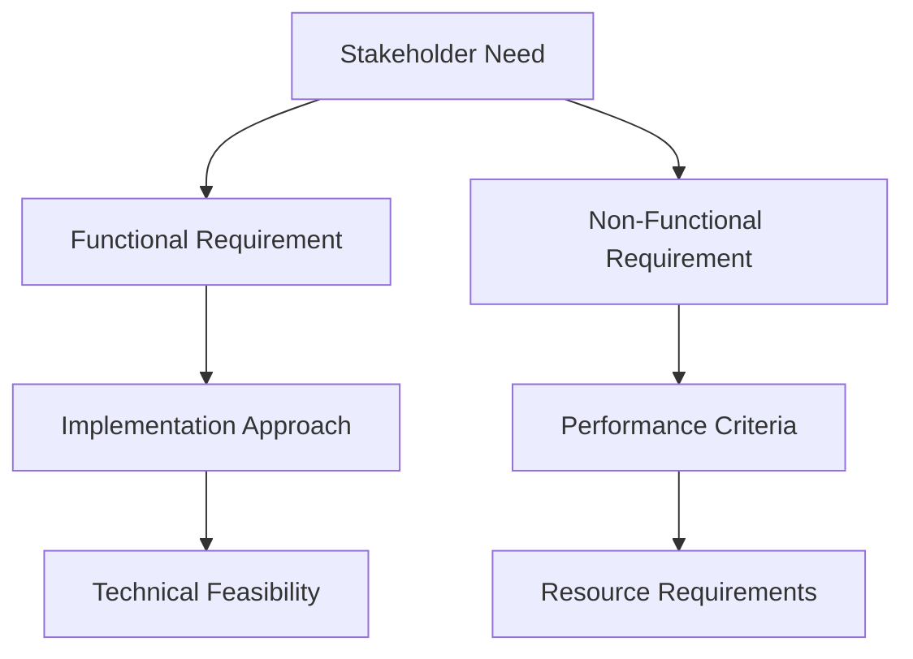

# Advanced Requirements & Feasibility Analysis Guidelines

## Description
Comprehensive requirements analysis using Volere + MoSCoW + PACT methodology with Sequential Thinking (15+ rounds with dynamic branching) and Shrimp Task Manager tools. Systematically captures, classifies, prioritizes, and validates requirements through evidence-based feasibility assessment. Use for any project planning, feature development, or system design requiring rigorous requirements analysis and feasibility validation.

## 🚨 CRITICAL EVIDENCE REQUIREMENT WARNING 🚨
**ABSOLUTE REQUIREMENT: EVERY ASSERTION MUST BE BACKED BY REAL EVIDENCE**

- **NO IMAGINATION**: Do not infer missing details; identify and log gaps
- **NO LYING**: If a source is unavailable, say so and raise an action
- **NO ASSUMPTIONS**: Do not assume requirements, capabilities, or constraints without evidence
- **NO SPECULATION**: Do not guess about stakeholder needs or technical feasibility

- **REQUIRED EVIDENCE SOURCES**:
  - **Source Documents**: BRDs, PRDs, RFCs, design docs; quote exact sections with line numbers
  - **Code/Interfaces**: API specs, schemas, interface definitions with commit hashes
  - **Operational Artifacts**: SLAs, capacity reports, runbooks with version/date
  - **Standards/Regulations**: Cite specific clauses with document ID and section
  - **Stakeholder Inputs**: Minutes, emails, formal sign-offs with timestamps
  - **AugmentCode Context Engine**: Use for codebase understanding and current capabilities
  - **Web Searches**: For industry standards, best practices, technology limitations
  - **System Analysis**: Actual performance metrics, resource constraints, dependencies
- **EVIDENCE DOCUMENTATION**: For every requirement, explicitly state: "Evidence: [source] shows '[verbatim excerpt/ID]' (link/ref)"
- **MISSING EVIDENCE**: When evidence is unavailable, state: "Evidence not found — requires [specific artifact/stakeholder/measurement]; owner: [name]; due: [date]"

## Enhanced Evidence Authoring Patterns

### Evidence Citation Templates
**Claim with Quote:**
*"REQ-012 requires ≤150ms P95 latency. Evidence: PRD §4.2 line 118 states 'The API SHALL respond within 150ms for 95th percentile of requests.'"*

**Constraint Reference:**
*"REQ-021 must store PII in region. Evidence: DPA §3.1 mandates 'data residency in SG.'"*

**Missing Evidence:**
*"Evidence not found — requires: API schema for /v2/measurements; owner: Backend Team; due: 2025-09-08."*

**Feasibility Verdict:**
*"PACT[Technology]=Partial (Conf=3). Evidence: load tests from 2025-08-30 show 210ms P95 under 3× load; mitigation: add read cache."*

## Objective
Transform ambiguous requests into **clear, testable requirements** with **priorities**, **fit criteria**, and **feasibility verdicts** (per PACT). Deliver a **decision-ready** package including risks, options, estimates, and a recommendation.

## Critical Bias Warning
**⚠️ MANDATORY BIAS CHECKS** before and during analysis:
- **Solution Bias**: Assuming solutions before understanding the actual problem
- **Gold-Plating Bias**: Adding "nice-to-haves" without business justification
- **Happy-Path Bias**: Ignoring degraded modes, failure handling, and operational costs
- **Tech Anchoring**: Forcing a favorite tool/stack irrespective of fit
- **Recency/Trend Bias**: Preferencing "new" over proven solutions
- **Stakeholder Dominance**: One loud voice ≠ collective agreement
- **Scope Creep Bias**: Expanding requirements beyond actual needs
- **Confirmation Bias**: Looking for requirements that support preferred approach
- **Clarity Bias**: Assuming understanding when requirements are actually ambiguous

## Tool Requirements (MANDATORY)
- **Sequential Decomposition Engine**: Breaks requirements into atomic units (Sequential Thinking Tool)
- **Evidence Collector**: Fetch/quote source passages with anchors/line IDs (Codebase Retrieval, Web Search)
- **Traceability Matrix Builder**: Req ↔ Source ↔ Fit Criterion ↔ Test (Working Memory Management)
- **Scoring Engine**: MoSCoW + PACT feasibility + risk scoring (Shrimp Task Manager Tools)
- **Reviewer Feedback Loop**: Capture clarifications and sign-offs (MCP Feedback Tool)
- **Working Memory Management**: Maintain persistent markdown files for context preservation
- **Bias Detection System**: Critical reflection and assumption challenging (reflect_task)

**Specific Tool Mapping:**
- **Sequential Thinking Tool**: MINIMUM 15 rounds with branching for complex analysis
- **Shrimp Task Manager Tools**:
  - process_thought: For step-by-step reasoning
  - analyze_task: For deep requirement analysis
  - research_mode: For systematic investigation
  - reflect_task: For critical reflection and bias checking
- **MCP Feedback Tool**: For all communications with the user. Prohibited not to call the tool

> **If any required tool is unavailable**, create manual placeholders and **flag deficits** in the Evidence Gaps section.

## Phase 0: Working Memory Initialization (MANDATORY FIRST STEP)

### Memory Management Setup
**CRITICAL**: Before any analysis begins, establish persistent working memory system:

#### 1. Memory Index Management
- **Create/Update**: `./.memories/index.md` with current analysis entry
- **Format**: `[YYYY-MM-DD-HHMMSS] - [Analysis Name] - [Status] - [Brief Description]`
- **Purpose**: Track all analysis runs for comparison and learning

#### 2. Analysis Run Folder Structure
Create folder: `./.memories/[YYYY-MM-DD-HHMMSS]-[analysis-name]/`
**Required Files in Each Run Folder:**
- `01_initial_understanding.md` - First interpretation of user requirements
- `02_discovery_log.md` - Ongoing discoveries, clarifications, amendments
- `03_clarification_requests.md` - All questions asked to user with responses
- `04_final_comparison.md` - Deviation analysis and over-engineering check
- `05_requirements_catalog.md` - Final structured requirements
- `06_decision_matrix.md` - Final feasibility and priority decisions

#### 3. Working Memory Maintenance Rules
- **Update Discovery Log**: After every user clarification or new finding
- **Cross-Reference**: Always check initial understanding vs current state
- **Preserve Context**: Never lose previous insights when new information arrives
- **Track Deviations**: Document when understanding changes and why

### User Clarification Protocol
**MANDATORY**: For unstructured or unclear requirements:
1. **Document Initial Understanding**: Write first interpretation in `01_initial_understanding.md`
2. **Identify Ambiguities**: List all unclear, conflicting, or missing elements
3. **Generate Clarification Questions**: Specific, targeted questions to resolve ambiguities
4. **Iterative Refinement**: Update discovery log after each user response
5. **Continuous Validation**: Regularly ask user to confirm understanding

### Clarification Question Framework
**Question Types to Always Ask:**
- **Scope Boundaries**: "What is explicitly IN scope vs OUT of scope?"
- **Success Criteria**: "How will you know this requirement is successfully met?"
- **Priority Rationale**: "Why is this requirement important to the business/user?"
- **Constraint Validation**: "What limitations or constraints must we work within?"
- **Stakeholder Confirmation**: "Who else needs to approve or validate this requirement?"
- **Use Case Scenarios**: "Can you walk me through how this would actually be used?"

## Phase 1: Requirement Capture & Classification (Volere Methodology)

### Cognitive Bias Checklist (Run BEFORE Analysis)
- [ ] **Solution Bias**: Am I assuming a solution before understanding the problem?
- [ ] **Scope Creep Bias**: Am I expanding requirements beyond actual needs?
- [ ] **Technical Bias**: Am I favoring technically interesting over business-valuable requirements?
- [ ] **Confirmation Bias**: Am I looking for requirements that support my preferred approach?
- [ ] **Anchoring Bias**: Am I over-weighting the first requirements received?
- [ ] **Availability Bias**: Am I favoring easily recalled similar projects?
- [ ] **Clarity Bias**: Am I assuming I understand when requirements are actually ambiguous?

### Requirement Classification Framework
**Requirement Types (Volere Standard)**:
- **Functional Requirements**: What the system must do (behaviors, operations, functions)
- **Non-Functional Requirements**: How the system must perform (performance, usability, reliability)
- **Constraints**: Fixed conditions that limit design choices (standards, hardware, deadlines)

### Atomic Requirements Framework (MANDATORY)
**Quality Rules for All Requirements:**
- **Single Purpose**: Each requirement addresses exactly one concern
- **Single Outcome**: Each requirement has exactly one measurable result
- **Description Limit**: ≤25 words for main description
- **Testable**: Must have measurable fit criterion
- **Unambiguous**: No "or/and" without quantifiers (split into separate requirements)
- **Traceable**: Must cite specific source with stable anchor (doc §/line, commit hash+path)

**Deterministic Parsing Rules:**
- If requirement contains multiple concerns → Split into separate atomic requirements
- If fit criterion lacks measurable unit + threshold → Flag as evidence gap
- If source lacks stable locator → Require specific anchor before proceeding
- If description >25 words → Simplify or split into multiple requirements

### Enhanced Volere Requirement Template (MANDATORY for each requirement)
```
Requirement ID: REQ-[TYPE]-[NUMBER]
Type: [Functional/Non-Functional/Constraint]
Description: [≤25 words, single purpose, single outcome]
Rationale: [Business reason/benefit with stakeholder owner]
Source: [Doc + section/line with stable anchor]
Fit Criterion: [Measurable acceptance with unit + threshold]
Priority: [Must/Should/Could/Won't - MoSCoW]
Dependencies: [Other requirements this depends on]
Conflicts: [Requirements this conflicts with]
Assumptions: [If any, with validation plan]
Open Questions: [Clarifications needed with owner/due date]
Evidence: [Verbatim quote: "source shows 'exact text' (link/ref)"]
```

## Structured Templates for AI Execution

### Requirement Row Template (Copy-Paste)
| REQ-ID | Type | Description | Rationale | Source (Doc §/Line) | Fit Criterion | MoSCoW | Assumptions | Dependencies | Evidence Quote |
|--------|------|-------------|-----------|---------------------|---------------|---------|-------------|--------------|----------------|
| REQ-F-001 | Functional | [≤25 words] | [Business benefit] | [Doc §X.Y line Z] | [Measurable with unit] | Must | [If any] | [REQ-IDs] | "Source shows 'exact text'" |

### PACT Verdict Template (Copy-Paste)
| REQ-ID | People (Y/P/N, Conf 1-5) | Activities (Y/P/N, Conf 1-5) | Context (Y/P/N, Conf 1-5) | Technology (Y/P/N, Conf 1-5) | Overall Verdict | Key Risks | Mitigations |
|--------|---------------------------|-------------------------------|----------------------------|------------------------------|-----------------|-----------|-------------|
| REQ-F-001 | Y, 4 | P, 3 | Y, 5 | P, 2 | Partial | [Top 3 risks] | [Specific actions] |

### Options Analysis Template (Copy-Paste)
| REQ-ID | Option | Summary | Fit Impact | Cost/Timeline (OOM) | Top 3 Risks | Mitigations | Decision |
|--------|--------|---------|------------|---------------------|-------------|-------------|----------|
| REQ-F-001 | A | [Change description] | [Impact on fit criterion] | [Order of magnitude] | [Risk 1, 2, 3] | [Specific actions] | Go/No-Go |

### Sequential Thinking Analysis (15+ Rounds with Dynamic Branching)
**CRITICAL**: Branch thinking immediately when multiple requirement domains emerge.

**Dynamic Branching Triggers**:
- Multiple stakeholder groups identified → Branch to investigate each group's needs
- Technical constraints discovered → Branch to assess feasibility implications
- Conflicting requirements found → Branch to resolve conflicts
- New requirement domains emerge → Branch to explore thoroughly
- **Ambiguity detected** → Branch to explore all possible interpretations
- **User clarification received** → Branch to reassess previous assumptions
- **Context changes** → Branch to evaluate impact on existing requirements

**Round Structure (Minimum 15, extend as needed)**:
- **Rounds 1-3**: Initial understanding documentation and ambiguity identification
- **Rounds 4-6**: User clarification and iterative refinement
- **Rounds 7-9**: Stakeholder identification and requirement elicitation
- **Rounds 10-12**: Requirement classification and conflict resolution
- **Rounds 13-15**: Feasibility assessment and prioritization
- **Rounds 15+**: Continue until all requirement domains and ambiguities exhausted

**Each Round Must Update Working Memory**:
- Update `02_discovery_log.md` with new findings
- Cross-reference with `01_initial_understanding.md` for deviations
- Document any clarification requests in `03_clarification_requests.md`
- Track branching decisions and their outcomes

## Phase 2: MoSCoW Prioritization

### MoSCoW Classification Criteria
**Must Have (Critical)**:
- System cannot function without this requirement
- Legal/regulatory compliance requirement
- Core business functionality essential for minimum viable product
- **Evidence Required**: Business case, regulatory documentation, or technical dependency proof

**Should Have (Important)**:
- Significant business value but system can function without it
- Enhances user experience or operational efficiency
- Planned for current release but could be deferred if necessary
- **Evidence Required**: Business value quantification or user impact analysis

**Could Have (Nice to Have)**:
- Adds value but minimal impact if excluded
- Enhancement that improves user satisfaction
- Can be easily deferred to future releases
- **Evidence Required**: User feedback or competitive analysis

**Won't Have (Out of Scope)**:
- Explicitly excluded from current scope
- Future consideration but not current priority
- Conflicts with other higher-priority requirements
- **Evidence Required**: Explicit stakeholder decision or resource constraint documentation

## Phase 3: PACT Feasibility Assessment

### PACT Framework Application
For each requirement, assess feasibility across four dimensions:

#### People Feasibility
- **Skills Available**: Do we have required expertise?
- **Capacity Available**: Do we have sufficient human resources?
- **Roles Defined**: Are responsibilities clear and assigned?
- **Training Needs**: What skill gaps need addressing?
- **Evidence Sources**: Team skill matrix, resource allocation, training records

#### Activities Feasibility  
- **Workflow Support**: Do current processes support this requirement?
- **Integration Points**: How does this fit with existing activities?
- **Process Changes**: What workflow modifications are needed?
- **Timeline Compatibility**: Does this fit within project schedule?
- **Evidence Sources**: Process documentation, workflow analysis, project timeline

#### Context Feasibility
- **Environmental Constraints**: Does operating environment permit this?
- **Regulatory Compliance**: Are there legal/regulatory barriers?
- **Organizational Culture**: Does this align with organizational values?
- **Market Conditions**: Do external factors support this requirement?
- **Evidence Sources**: Environmental analysis, compliance documentation, market research

#### Technology Feasibility
- **Technical Capability**: Can current technology stack support this?
- **Performance Requirements**: Can system meet performance criteria?
- **Integration Compatibility**: Does this work with existing systems?
- **Scalability**: Can this scale to required levels?
- **Evidence Sources**: Technical documentation, performance benchmarks, architecture analysis

### PACT Scoring Matrix
For each requirement and PACT dimension:
- **Feasible (3)**: Strong evidence supports feasibility
- **Partially Feasible (2)**: Some constraints but manageable with effort
- **Not Feasible (1)**: Significant barriers, requires major changes
- **Unknown (0)**: Insufficient evidence to determine feasibility

## Phase 4: Options Analysis for Non-Feasible Requirements

### Options Development Framework
**For any requirement with PACT verdict = Partial or No:**

#### Option Generation Rules
- **Option A**: Minimal change to achieve core intent
- **Option B**: Alternative approach with different trade-offs
- **Option C**: Scope reduction or phased implementation
- **Option D**: Out-of-scope (Won't Have) with future consideration

#### Required Analysis per Option
**For each option, document:**
- **Change Summary**: What deviates from original requirement
- **Fit Criterion Impact**: How success measurement changes
- **Cost/Timeline Estimate**: Order-of-magnitude (days/weeks/months)
- **Risk Profile**: Top 3 risks with likelihood and impact
- **Dependency Changes**: New dependencies or removed dependencies
- **Stakeholder Impact**: Who is affected and how

#### Option Decision Criteria
- **Feasibility**: Can this actually be implemented?
- **Value**: Does this deliver meaningful business benefit?
- **Cost**: Is the effort justified by the outcome?
- **Risk**: Are risks acceptable and mitigatable?
- **Alignment**: Does this support overall project goals?

## Phase 5: Decision Gates & Go/No-Go Framework

### Four-Gate Decision Framework
**All gates must pass before proceeding to implementation:**

#### Gate 1: Requirement Readiness
- **Criteria**: No open clarifications; all fit criteria testable
- **Evidence Required**: Complete requirement templates with evidence quotes
- **Decision**: Ready for feasibility assessment / Needs clarification

#### Gate 2: Feasibility Assessment
- **Criteria**: All Must requirements have PACT=Yes or approved option
- **Evidence Required**: PACT analysis with confidence scores ≥3
- **Decision**: Feasible as specified / Requires options analysis

#### Gate 3: Risk Acceptability
- **Criteria**: No unmitigated high-risk Must requirements
- **Evidence Required**: Risk register with mitigation plans
- **Decision**: Risks acceptable / Requires risk mitigation

#### Gate 4: Plan Viability
- **Criteria**: Timeline and resources align with constraints
- **Evidence Required**: Resource allocation and timeline estimates
- **Decision**: Go / Go-with-Options / No-Go

### Gate Documentation Requirements
**For each gate:**
- **Gate Status**: Pass/Fail with evidence
- **Decision Rationale**: Why this decision was made
- **Approver**: Named stakeholder with authority
- **Date**: When decision was made
- **Conditions**: Any conditions for proceeding

## Phase 6: Traceability & Risk Mapping

### Five Traceability Matrices (MANDATORY)
1. **Req ↔ Source Evidence**: Every requirement linked to source quote
2. **Req ↔ Fit Criterion ↔ Acceptance Test**: Testability chain
3. **Req ↔ Dependencies**: Upstream and downstream relationships
4. **Req ↔ Risks/Mitigations**: Risk coverage analysis
5. **Req ↔ PACT Verdicts ↔ Options**: Feasibility decision trail

### Enhanced Risk Assessment Framework
For each requirement, identify and assess:
- **Technical Risks**: Implementation complexity, technology maturity
- **Resource Risks**: Skill availability, capacity constraints
- **Schedule Risks**: Timeline dependencies, critical path impacts
- **Business Risks**: Market changes, stakeholder alignment
- **Integration Risks**: System compatibility, data migration

### Risk Scoring (Enhanced)
- **Probability (1-5)**: How likely is this risk to occur?
- **Impact (1-5)**: How severe would the consequences be?
- **Risk Score**: Probability × Impact (1-25 scale)
- **Severity Classification**:
  - **High (16-25)**: Blocks delivery or breaches compliance
  - **Medium (6-15)**: Material delay/cost; mitigatable
  - **Low (1-5)**: Minor impact; routine mitigation
- **Mitigation Strategy**: Specific actions with owners and dates

## Phase 7: RAG Dashboard & Executive Communication

### RAG (Red-Amber-Green) Status Framework
**For executive communication and decision-making:**

#### RAG Classification Rules
- **🟢 Green**: Must requirement with PACT=Yes and Low risk (≤9)
- **🟡 Amber**: Must requirement with Partial feasibility and accepted Option
- **🔴 Red**: Must requirement with No feasibility or unmitigated High risk (≥16)

#### RAG Dashboard Template
| REQ-ID | Description | Priority | RAG Status | Key Issue | Mitigation/Option | Owner | Due Date |
|--------|-------------|----------|------------|-----------|-------------------|-------|----------|
| REQ-F-001 | [≤25 words] | Must | 🔴 Red | Technology constraint | Option A: Alternative approach | [Name] | [Date] |

### Executive Summary Framework
**One-page summary including:**
- **Scope Overview**: Total requirements by type and priority
- **RAG Summary**: Count of Red/Amber/Green status
- **Key Decisions**: Top 3 decisions needed from leadership
- **Resource Impact**: High-level cost and timeline implications
- **Risk Highlights**: Top 3 risks requiring attention
- **Recommendation**: Go/Go-with-Options/No-Go with rationale

## Phase 8: Acceptance Test Integration

### Acceptance Test Skeleton Framework
**Link fit criteria directly to testable acceptance criteria:**

#### Test Template (Given/When/Then)
```
REQ-ID: [ID] — [Title]
Fit Criterion: [Measurable criterion with unit + threshold]
Acceptance Test:
  Given [Preconditions and test setup]
  When [Action or trigger event]
  Then [Expected measurable outcome matching fit criterion]
```

#### Test Examples
```
REQ-ID: REQ-F-012 — API Response Time
Fit Criterion: P95 ≤ 150ms under 3× baseline traffic for 10 minutes
Acceptance Test:
  Given a 3× synthetic load (RPS N) on /v2/query endpoint
  When traffic runs continuously for 10 minutes
  Then measured P95 latency ≤ 150ms and error rate < 0.1%

REQ-ID: REQ-C-021 — Data Residency Compliance
Fit Criterion: All PII stored in Singapore region only
Acceptance Test:
  Given a dataset containing PII fields
  When writing records via the data layer
  Then data files and backups are located in SG region buckets only
```

### Testability Validation
**For each requirement:**
- **Fit Criterion Check**: Contains measurable unit + threshold
- **Test Feasibility**: Can be automated or manually executed
- **Evidence Chain**: Requirement → Fit Criterion → Test → Result
- **Coverage Analysis**: All Must requirements have acceptance tests

## Phase 9: Decision Table Generation

### Final Output: Comprehensive Decision Matrix
Each requirement row must include:

| Req ID | Type | Description | MoSCoW | Fit Criterion | People | Activities | Context | Technology | Overall Feasibility | Risk Score | RAG | Decision | Rationale |
|--------|------|-------------|---------|---------------|---------|------------|---------|------------|-------------------|------------|-----|----------|-----------|
| REQ-F-001 | Functional | [≤25 words] | Must | [Measurable] | Y,4 | P,3 | Y,5 | P,2 | Partial | 12 | 🟡 | Option A | Technology gap mitigated |

### Enhanced Decision Criteria
- **🟢 Approve**: High feasibility (≥2.5 average) + Must/Should priority + Low risk (≤9)
- **🟡 Conditional**: Medium feasibility (2.0-2.4) + Should/Could priority + Medium risk (10-15) + Approved Option
- **🔴 Defer**: Low feasibility (<2.0) OR High risk (≥16) OR Won't priority
- **❓ Investigate**: Unknown feasibility (0 scores) requiring further analysis

## Phase 6: Final Validation & Deviation Analysis

### Working Memory Cross-Reference (MANDATORY)
**Before finalizing any analysis:**

#### 1. Initial vs Final Comparison
- **Compare**: `01_initial_understanding.md` vs final requirements catalog
- **Document**: All deviations, scope changes, and requirement evolution
- **Analyze**: Whether changes were justified by evidence or represent scope creep
- **Record**: In `04_final_comparison.md` with detailed rationale

#### 2. Over-Engineering Detection
**Critical Questions to Answer:**
- Did the final solution become more complex than the original need?
- Are we solving problems the user never actually had?
- Did technical preferences override business requirements?
- Are we building features that won't be used?
- **Evidence Required**: Compare user's original words vs final requirements

#### 3. Goal Alignment Verification
- **Original Intent**: What did the user actually want to achieve?
- **Final Scope**: What are we planning to deliver?
- **Gap Analysis**: Any misalignment between intent and scope?
- **Justification**: Evidence-based rationale for any scope expansion

### Multi-Run Comparison Framework
**For subsequent analysis runs:**

#### 1. Run Comparison Protocol
- **Compare**: Decision matrices across different runs
- **Analyze**: Consistency in requirement identification and prioritization
- **Document**: Variations in interpretation and their causes
- **Learn**: Patterns in requirement elicitation effectiveness

#### 2. Learning Integration
- **Track**: Which clarification approaches work best
- **Document**: Common ambiguity patterns and resolution strategies
- **Improve**: Refine question frameworks based on experience
- **Share**: Update ruleset with proven techniques

## Phase 7: Comprehensive Documentation Requirements

### Complete Requirements Analysis Package
**ALL of the following must be documented in detail:**

#### 1. Working Memory Documentation
- **Initial Understanding**: Complete `01_initial_understanding.md`
- **Discovery Evolution**: Complete `02_discovery_log.md` with timeline
- **Clarification History**: Complete `03_clarification_requests.md` with responses
- **Deviation Analysis**: Complete `04_final_comparison.md` with justification

#### 2. Stakeholder Analysis Documentation
- **Stakeholder Identification**: All parties with requirements input
- **Stakeholder Influence Matrix**: Power vs. interest analysis
- **Requirements Sources**: Where each requirement originated
- **Conflict Resolution**: How conflicting stakeholder needs were resolved

#### 3. Sequential Thinking Round Documentation
**For EVERY round (15+ minimum):**
- **Round Number & Objective**: What this round investigates
- **Evidence Sources Used**: Specific documents, interviews, research performed
- **Requirements Discovered**: New requirements identified with evidence
- **Conflicts Identified**: Any requirement conflicts discovered
- **Branching Decisions**: If new paths started and why
- **Working Memory Updates**: What was added to discovery log
- **Clarification Triggers**: What ambiguities were identified
- **Round Summary**: Key conclusions and next steps

#### 3. Requirement Classification Documentation
**For EACH requirement:**
- **Complete Volere Template**: All fields populated with evidence
- **Classification Rationale**: Why categorized as functional/non-functional/constraint
- **Source Traceability**: Clear link to originating stakeholder/document
- **Fit Criterion Validation**: How the success criterion was determined

#### 4. MoSCoW Prioritization Documentation
**For each priority level:**
- **Prioritization Rationale**: Why each requirement received its priority
- **Business Value Analysis**: Quantified impact where possible
- **Stakeholder Agreement**: Evidence of stakeholder consensus on priorities
- **Priority Conflicts**: Any disagreements and resolution approach

#### 5. PACT Feasibility Assessment Documentation
**For each requirement and PACT dimension:**
- **Feasibility Score**: Numerical score with detailed justification
- **Evidence Summary**: All evidence considered in feasibility assessment
- **Constraint Analysis**: Specific limitations or barriers identified
- **Mitigation Options**: Potential approaches to address feasibility gaps

#### 6. Risk Analysis Documentation
**For each identified risk:**
- **Risk Description**: Clear statement of potential problem
- **Probability Assessment**: Likelihood with supporting evidence
- **Impact Assessment**: Consequences with quantification where possible
- **Risk Score Calculation**: Methodology and final score
- **Mitigation Strategy**: Specific actions to reduce risk

#### 7. Decision Matrix Documentation
- **Complete Decision Table**: All requirements with full analysis
- **Decision Criteria**: Explicit rules used for approve/defer/investigate decisions
- **Trade-off Analysis**: How competing requirements were balanced
- **Recommendation Summary**: Final recommendations with implementation priority

#### 8. Mermaid Requirements Structure Diagram
**Create comprehensive mermaid flowchart showing:**


### Quality Assurance Checklist

#### Evidence Integrity (CRITICAL)
- [ ] Every requirement backed by specific, real evidence sources
- [ ] No assumptions, speculation, or imagined requirements used
- [ ] All stakeholder inputs actually documented and quoted accurately
- [ ] Technical constraints verified through actual system analysis
- [ ] Missing evidence explicitly acknowledged and documented

#### Analysis Completeness
- [ ] Minimum 15 rounds of sequential thinking completed and documented
- [ ] All cognitive biases explicitly checked and countered
- [ ] Dynamic branching used when multiple requirement domains emerged
- [ ] Complete Volere templates for all requirements
- [ ] MoSCoW prioritization with evidence-based rationale
- [ ] PACT feasibility assessment for all requirements
- [ ] Risk analysis completed with mitigation strategies

#### Documentation Completeness
- [ ] Stakeholder analysis fully documented with evidence
- [ ] All sequential thinking rounds documented with sources
- [ ] Complete requirement classification with rationale
- [ ] MoSCoW prioritization fully justified
- [ ] PACT feasibility assessment documented for all dimensions
- [ ] Risk analysis completed with scoring and mitigation
- [ ] Decision matrix completed with clear rationale
- [ ] Mermaid diagram accurately represents requirement structure

### Final Deliverable Package
Submit comprehensive requirements analysis using feedback tool, including ALL of the following:

**📋 Complete Documentation Package:**
1. **Working Memory Archive** (complete .memories folder with all 6 required files)
2. **Deviation Analysis** (initial vs final comparison with over-engineering assessment)
3. **Executive Summary** (one-page with RAG dashboard and key decisions)
4. **Requirements Catalog** (complete enhanced Volere templates with evidence quotes)
5. **PACT Feasibility Workbook** (all dimensions with confidence scoring and evidence)
6. **Options Analysis** (A/B/C alternatives for all Partial/No feasibility requirements)
7. **Decision Gates Register** (all 4 gates with pass/fail status and approvers)
8. **Risk Analysis Matrix** (enhanced scoring with severity classification and mitigations)
9. **Traceability Matrices** (all 5 matrices: Source, Test, Dependencies, Risk, Options)
10. **RAG Dashboard** (Red/Amber/Green status for all Must requirements)
11. **Acceptance Test Skeletons** (Given/When/Then for all Must requirements)
12. **Decision Matrix** (complete with RAG status and final recommendations)
13. **Evidence Inventory** (all source quotes with stable anchors and gaps log)
14. **Sequential Thinking Log** (all 15+ rounds with evidence sources and memory updates)
15. **Mermaid Requirements Diagram** (complete visual representation)
16. **Memory Index Update** (updated .memories/index.md with current analysis entry)

### Self-Contained Final Report Requirements
**CRITICAL**: The user will ONLY see what's sent via MCP Feedback tool. The final report must be completely self-contained and answer all "WTF/simi lanjiao/huh?" questions:

#### Self-Contained Report Must Include
- **Complete Requirements List**: Include FULL descriptions, not just REQ-IDs
- **Full Decision Matrix**: Show all requirements with complete details in table format
- **Plain Language Explanations**: Explain technical decisions in business terms
- **Clear Rationale**: Every decision must have obvious reasoning with evidence
- **Implementation Guidance**: Specific next steps and effort estimates
- **Risk Context**: Explain what could go wrong and how it's mitigated
- **Business Impact**: Connect technical decisions to business outcomes

#### "WTF/Huh?" Prevention Checklist
- [ ] Can user understand each requirement without seeing background work?
- [ ] Are all decisions clearly justified with evidence?
- [ ] Is the implementation plan actionable and realistic?
- [ ] Are risks explained in terms of business impact?
- [ ] Does the report stand alone without needing additional context?
- [ ] Are technical terms explained or avoided?
- [ ] Is the recommendation clear and well-supported?

**⚠️ SUBMISSION REQUIREMENTS:**
- Every assertion backed by specific evidence sources with verbatim quotes
- No unsupported assumptions or speculation about needs or feasibility
- Complete working memory documentation showing requirement evolution
- Deviation analysis proving final scope aligns with original intent
- Clear documentation of all analysis paths and decision rationale
- Evidence-based scoring and rationale for all feasibility assessments
- Actionable, prioritized recommendations with implementation guidance
- All Must requirements either feasible or have an approved Option
- Risks quantified with mitigations; no hidden assumptions
- Acceptance tests align with fit criteria
- Package is decision-ready: reviewer can approve or redirect in one meeting
- **Memory index updated** with current analysis for future comparison

## Critical Constraints & Boundaries

### Analysis Phase Restrictions
- **NO SOLUTION DESIGN**: Focus on requirements, not implementation details
- **NO GOLD-PLATING**: Only include requirements with clear business justification
- **NO ASSUMPTION-BASED CONCLUSIONS**: Every requirement must have evidence
- **NO SINGLE-STAKEHOLDER DOMINANCE**: Validate requirements across stakeholder groups
- **NO HAPPY-PATH ONLY**: Consider failure modes, degraded performance, operational costs

### Quality Gates (MANDATORY)
- **Requirement Quality**: Atomic, unambiguous, testable; fit criterion stated
- **Evidence Integrity**: Every requirement has quoted source line/section
- **Feasibility Coverage**: All Must requirements have PACT=Yes or approved option
- **Risk Management**: High risks enumerated with concrete mitigations
- **Traceability**: Req ↔ Source ↔ Fit Criterion ↔ Test mapped

### Decision Readiness Criteria
- **Executive Summary**: One-page with RAG status and key decisions
- **Options Analysis**: A/B/C for all non-feasible Must requirements
- **Cost/Timeline**: Order-of-magnitude estimates for all options
- **Risk Register**: Probability × Impact scoring with mitigation plans
- **Approval Trail**: Named stakeholders for all key decisions

**Remember**: The goal is implementable requirements that solve real problems, not wishful thinking. Better to spend time understanding actual needs through iterative clarification than building over-engineered solutions that miss the mark.

#####FINAL OUTPUT: SEND THE USER A DETAILED REQUIREMENTS ANALYSIS REPORT USING THE FEEDBACK TOOL. IT IS PROHIBITED NOT TO SEND THE FULL COMPLETE DOCUMENTATION PACKAGE TO FEEDBACK TOOL.
**NOW CALL THE SHRIMP TASK MANAGER TOOL TO START THE NECESSARY. IT IS PROHIBITED NOT TO CALL THE TOOL.**
