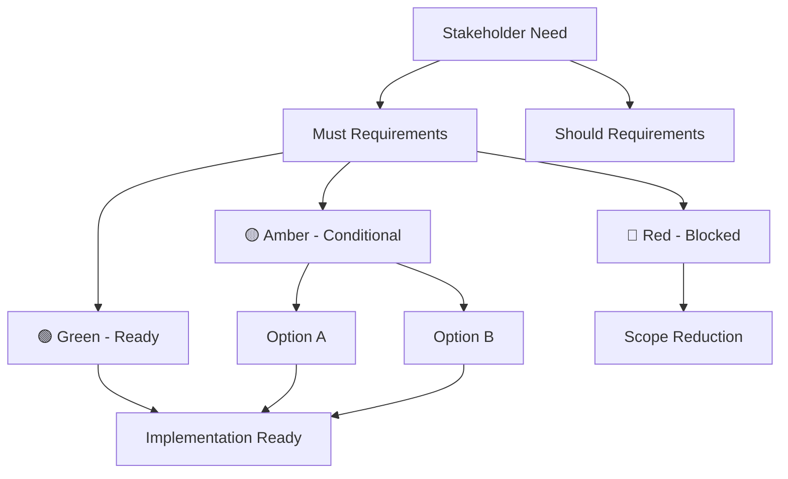

# Phase 9: Final Decision Matrix & Deliverables

## Objective
Complete comprehensive decision matrix, perform deviation analysis against initial understanding, and deliver complete documentation package to user via MCP Feedback tool.

## 🚨 CRITICAL CONSTRAINTS (ALWAYS REMEMBER)
- **NO LYING**: If evidence unavailable, say so and raise action
- **NO ASSUMPTIONS**: Every decision needs evidence-based rationale
- **NO SPECULATION**: Do not guess about final recommendations
- **COMPLETE PACKAGE**: All deliverables must be included

## Context Refresh
**MANDATORY**: Read ALL memory files before proceeding:
- `.memories/[current-analysis]/01_initial_understanding.md`
- `.memories/[current-analysis]/02_discovery_log.md`
- `.memories/[current-analysis]/03_clarification_requests.md`
- `.memories/[current-analysis]/05_requirements_catalog.md`
- `.memories/[current-analysis]/06_decision_matrix.md`

## Phase 9 Tasks

### Task 1: Complete Final Decision Matrix
**Create comprehensive matrix with all analysis results:**

#### Decision Matrix Template
| Req ID | Type | Description | MoSCoW | Fit Criterion | People | Activities | Context | Technology | Overall Feasibility | Risk Score | RAG | Decision | Rationale |
|--------|------|-------------|---------|---------------|---------|------------|---------|------------|-------------------|------------|-----|----------|-----------|
| REQ-F-001 | Functional | [≤25 words] | Must | [Measurable] | Y,4 | P,3 | Y,5 | P,2 | Partial | 12 | 🟡 | Option A | Technology gap mitigated |

#### Enhanced Decision Criteria
- **🟢 Approve**: High feasibility (≥2.5 average) + Must/Should priority + Low risk (≤9)
- **🟡 Conditional**: Medium feasibility (2.0-2.4) + Should/Could priority + Medium risk (10-15) + Approved Option
- **🔴 Defer**: Low feasibility (<2.0) OR High risk (≥16) OR Won't priority
- **❓ Investigate**: Unknown feasibility (0 scores) requiring further analysis

### Task 2: Deviation Analysis & Over-Engineering Check
**Compare initial vs final understanding:**

#### Initial vs Final Comparison
1. **Read**: `01_initial_understanding.md` - original interpretation
2. **Compare**: Against final requirements catalog
3. **Document**: All deviations, scope changes, requirement evolution
4. **Analyze**: Whether changes were justified by evidence or represent scope creep

#### Over-Engineering Detection Questions
- Did the final solution become more complex than the original need?
- Are we solving problems the user never actually had?
- Did technical preferences override business requirements?
- Are we building features that won't be used?

#### Document in `04_final_comparison.md`
```
# Final Comparison Analysis

## Original User Intent
[What user originally wanted from 01_initial_understanding.md]

## Final Scope
[What we're planning to deliver]

## Key Deviations
1. [Deviation] - [Justification] - [Evidence]
2. [Deviation] - [Justification] - [Evidence]

## Over-Engineering Assessment
- Complexity increase justified: [Yes/No] - [Evidence]
- All features have business value: [Yes/No] - [Evidence]
- Scope aligned with original intent: [Yes/No] - [Evidence]

## Recommendation
[Whether final scope is appropriate or needs adjustment]
```

### Task 3: Compile Complete Documentation Package
**Ensure all 16 deliverables are complete:**

1. **Working Memory Archive** (.memories folder with 6 files)
2. **Executive Summary** (one-page RAG dashboard)
3. **Requirements Catalog** (enhanced Volere templates)
4. **PACT Feasibility Workbook** (confidence scoring)
5. **Options Analysis** (A/B/C for non-feasible requirements)
6. **Decision Gates Register** (4 gates with approvers)
7. **Risk Analysis Matrix** (probability × impact with mitigations)
8. **Traceability Matrices** (5 types)
9. **RAG Dashboard** (Red/Amber/Green status)
10. **Acceptance Test Skeletons** (Given/When/Then)
11. **Decision Matrix** (final recommendations)
12. **Evidence Inventory** (source quotes and gaps)
13. **Sequential Thinking Log** (documented in discovery log)
14. **Mermaid Requirements Diagram** (visual representation)
15. **Deviation Analysis** (over-engineering check)
16. **Memory Index Update** (updated .memories/index.md)

### Task 3.5: Prepare Self-Contained Final Report
**CRITICAL**: The user will ONLY see what's sent via MCP Feedback tool. The final report must be completely self-contained and answer all "WTF/simi lanjiao/huh?" questions:

#### Self-Contained Report Requirements
- **Complete Requirements List**: Include FULL descriptions, not just REQ-IDs
- **Full Decision Matrix**: Show all requirements with complete details
- **Plain Language Explanations**: Explain technical decisions in business terms
- **Clear Rationale**: Every decision must have obvious reasoning
- **Implementation Guidance**: Specific next steps and effort estimates
- **Risk Context**: Explain what could go wrong and how it's mitigated
- **Business Impact**: Connect technical decisions to business outcomes

#### "WTF/Huh?" Prevention Checklist
- [ ] Can user understand each requirement without seeing background work?
- [ ] Are all decisions clearly justified with evidence?
- [ ] Is the implementation plan actionable and realistic?
- [ ] Are risks explained in terms of business impact?
- [ ] Does the report stand alone without needing additional context?
- [ ] Are technical terms explained or avoided?
- [ ] Is the recommendation clear and well-supported?

### Task 4: Create Mermaid Requirements Diagram
**Visual representation of requirement structure:**



### Task 5: Multi-Run Comparison Framework
**For subsequent analysis runs (if applicable):**

#### Run Comparison Protocol
- **Compare**: Decision matrices across different runs
- **Analyze**: Consistency in requirement identification and prioritization
- **Document**: Variations in interpretation and their causes
- **Learn**: Patterns in requirement elicitation effectiveness

#### Learning Integration
- **Track**: Which clarification approaches work best
- **Document**: Common ambiguity patterns and resolution strategies
- **Improve**: Refine question frameworks based on experience
- **Share**: Update ruleset with proven techniques

### Task 6: Update Memory Index
**Complete the analysis entry in `.memories/index.md`:**
```
[YYYY-MM-DD-HHMMSS] - [analysis-name] - COMPLETE - [Brief Description]
Folder: ./.memories/[YYYY-MM-DD-HHMMSS]-[analysis-name]/
Purpose: [What this analysis was for]
Stakeholders: [Who was involved]
Key Outcomes: [Major decisions or findings]
Deviations: [Any scope changes or over-engineering detected]
Lessons Learned: [What worked well, what didn't]
Comparison Notes: [If multiple runs, what was learned from comparison]
```

## Tools & Iterations
- **Sequential Thinking Tool**: 5-7 rounds for final analysis and package compilation
- **Evidence Synthesis**: Consolidate all findings into coherent package
- **Quality Assurance**: Systematic review of all deliverables

## Expected Outputs
- **Complete**: Final decision matrix in `06_decision_matrix.md`
- **Complete**: Deviation analysis in `04_final_comparison.md`
- **Update**: Memory index with final status
- **Deliver**: Complete package via MCP Feedback tool

## Comprehensive Quality Assurance Checklist

### Evidence Integrity (CRITICAL)
- [ ] Every requirement backed by specific, real evidence sources
- [ ] No assumptions, speculation, or imagined requirements used
- [ ] All stakeholder inputs actually documented and quoted accurately
- [ ] Technical constraints verified through actual system analysis
- [ ] Missing evidence explicitly acknowledged and documented

### Analysis Completeness
- [ ] Minimum 15 rounds of sequential thinking completed and documented
- [ ] All cognitive biases explicitly checked and countered
- [ ] Dynamic branching used when multiple requirement domains emerged
- [ ] Complete Volere templates for all requirements
- [ ] MoSCoW prioritization with evidence-based rationale
- [ ] PACT feasibility assessment for all requirements
- [ ] Risk analysis completed with mitigation strategies

### Documentation Completeness
- [ ] Stakeholder analysis fully documented with evidence
- [ ] All sequential thinking rounds documented with sources
- [ ] Complete requirement classification with rationale
- [ ] MoSCoW prioritization fully justified
- [ ] PACT feasibility assessment documented for all dimensions
- [ ] Risk analysis completed with scoring and mitigation
- [ ] Decision matrix completed with clear rationale
- [ ] Mermaid diagram accurately represents requirement structure

### Final Package Validation
- [ ] All 16 deliverables are complete and consistent
- [ ] Decision matrix includes all requirements with evidence
- [ ] Deviation analysis compares initial vs final scope
- [ ] Over-engineering assessment completed
- [ ] Memory index updated with final status
- [ ] All evidence gaps are documented
- [ ] Package is decision-ready for stakeholder review

## Final Package Summary Template
```
# Requirements Analysis Complete - [Analysis Name]

## 🎯 EXECUTIVE SUMMARY
- **Project**: [Brief project description]
- **Analysis Duration**: [Start] to [End] ([X] hours comprehensive analysis)
- **Overall Recommendation**: [Go/Go-with-Options/No-Go] [✅/⚠️/❌]

## 📊 KEY METRICS
**Requirements Summary:**
- Total: [X] requirements ([F] Functional, [N] Non-Functional, [C] Constraints)
- Must Have: [X] requirements ([Y]% of total)
- Should Have: [X] requirements ([Y]% of total)
- Could Have: [X] requirements ([Y]% of total)

**RAG Status (Must Requirements):**
- 🟢 Green (Ready): [X] requirements ([Y]%)
- 🟡 Amber (Conditional): [X] requirements ([Y]%)
- 🔴 Red (Blocked): [X] requirements ([Y]%)

**Decision Matrix Results:**
- 🟢 APPROVE: [X] requirements ([Y]%) - Ready for immediate implementation
- 🟡 CONDITIONAL: [X] requirements ([Y]%) - Approved with specific options
- 🔴 DEFER: [X] requirements ([Y]%) - Blocked or out of scope

## 📋 COMPLETE REQUIREMENTS CATALOG
[CRITICAL: Include FULL requirements list with descriptions, not just IDs]

### Must Have Requirements (Priority 1)
**REQ-F-001: [Full Requirement Title]**
- **Description**: [Complete requirement description in plain language]
- **Business Rationale**: [Why this is critical]
- **Fit Criterion**: [How success is measured]
- **RAG Status**: [🟢/🟡/🔴] [Status explanation]
- **Decision**: [Approve/Conditional/Defer] - [Rationale]
- **Implementation**: [Effort estimate and approach]

[Repeat for ALL Must requirements]

### Should Have Requirements (Priority 2)
[Same format for all Should requirements]

### Could Have Requirements (Priority 3)
[Same format for all Could requirements]

## 🔑 CRITICAL DECISIONS MADE
[For each major decision, explain the "WTF/why" clearly]

**1. [Decision Title] - [Option Selected] Approved**
- **The Problem**: [What issue this solves in plain language]
- **Options Considered**: [A/B/C options with trade-offs]
- **Decision**: [Which option and why]
- **Rationale**: [Evidence-based reasoning]
- **Implementation**: [Effort and approach]
- **Business Impact**: [What this means for the project]

[Repeat for all major decisions]

## 📈 FEASIBILITY ASSESSMENT
**Overall Project Feasibility**: [HIGHLY FEASIBLE/FEASIBLE/CHALLENGING/NOT FEASIBLE]

**PACT Analysis Results:**
- **People**: [✅/⚠️/❌] [Explanation of skills, capacity, roles]
- **Activities**: [✅/⚠️/❌] [Explanation of process fit and workflow]
- **Context**: [✅/⚠️/❌] [Explanation of environment and constraints]
- **Technology**: [✅/⚠️/❌] [Explanation of technical capability]

## ⚠️ RISK MANAGEMENT
**Top 3 Risks with Approved Mitigations:**

**1. [Risk Name] (Score: [X])**
- **Risk**: [What could go wrong in plain language]
- **Probability**: [X/5] - [Likelihood explanation]
- **Impact**: [X/5] - [Consequence explanation]
- **Mitigation**: [Specific actions to reduce risk]
- **Owner**: [Who is responsible]
- **Status**: [Current mitigation status]

[Repeat for top 3 risks]

## 🚀 IMPLEMENTATION PLAN
**Phase 1: [Name] (Days [X-Y])**
- [Key activities and deliverables]
- [Requirements addressed]

**Phase 2: [Name] (Days [X-Y])**
- [Key activities and deliverables]
- [Requirements addressed]

[Continue for all phases]

## 📊 COMPLETE DECISION MATRIX
[CRITICAL: Include full decision matrix with all requirements]

| Req ID | Requirement Description | Type | Priority | People | Activities | Context | Technology | Overall Feasibility | Risk Score | RAG | Decision | Rationale |
|--------|------------------------|------|----------|---------|------------|---------|------------|-------------------|------------|-----|----------|-----------|
| REQ-F-001 | [Full description] | Functional | Must | Y,4 | P,3 | Y,5 | Y,4 | Feasible | 8 | 🟢 | Approve | [Clear rationale] |

[Include ALL requirements in the matrix]

## 📋 COMPLETE DELIVERABLES PACKAGE
**All 16 required deliverables completed and documented:**
✅ [Deliverable 1] - [Brief description of what this contains]
✅ [Deliverable 2] - [Brief description of what this contains]
[List all 16 with explanations]

## 🎯 NEXT STEPS
**Immediate Actions Required:**
- [Action 1] - [Why needed and by when]
- [Action 2] - [Why needed and by when]

**Success Conditions:**
- [Condition 1] - [How to measure success]
- [Condition 2] - [How to measure success]

**Expected Outcomes:**
- [Outcome 1] - [Business benefit]
- [Outcome 2] - [Business benefit]

## 📊 BUSINESS IMPACT
**Problems Solved:**
✅ [Problem 1] - [How it's solved]
✅ [Problem 2] - [How it's solved]

**Value Delivered:**
- **Technical**: [Technical benefits]
- **Business**: [Business benefits]
- **Operational**: [Operational benefits]
- **Strategic**: [Strategic benefits]

**Analysis Confidence**: [HIGH/MEDIUM/LOW] - [Reasoning]
**Implementation Readiness**: [EXCELLENT/GOOD/FAIR/POOR] - [Reasoning]
**Business Alignment**: [PERFECT/GOOD/FAIR/POOR] - [Reasoning]

[Final summary paragraph explaining overall recommendation]
```

## Navigation
**FINAL STEP**: Use MCP Feedback Tool to deliver complete analysis package to user

**CRITICAL SUBMISSION REQUIREMENTS:**
- Every assertion backed by specific evidence sources
- Complete working memory documentation showing requirement evolution
- Deviation analysis proving final scope aligns with original intent
- All Must requirements either feasible or have approved options
- Package is decision-ready for single-meeting approval/redirect
- Memory index updated with current analysis for future comparison

**MANDATORY**: Call MCP Feedback Tool with complete analysis report. IT IS PROHIBITED NOT TO CALL THE FEEDBACK TOOL.

**REFERENCE**: For detailed methodology, see `requirements_analysis.md` comprehensive framework.
