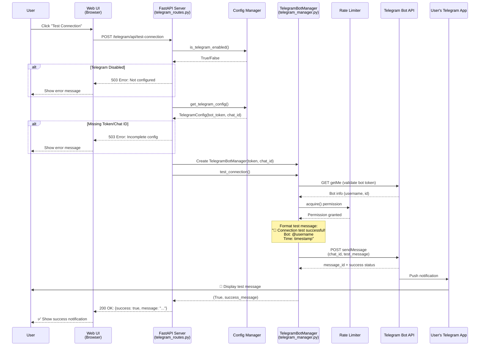
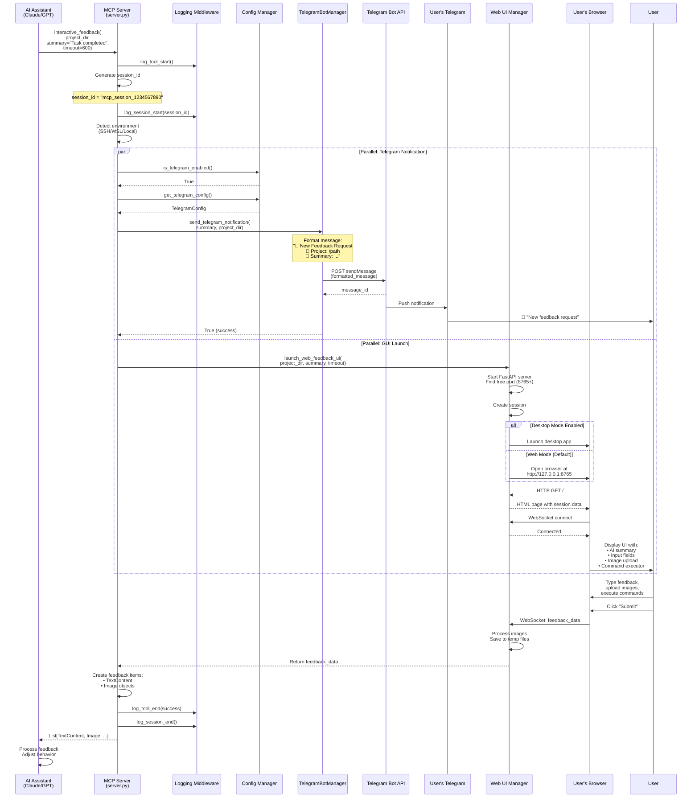
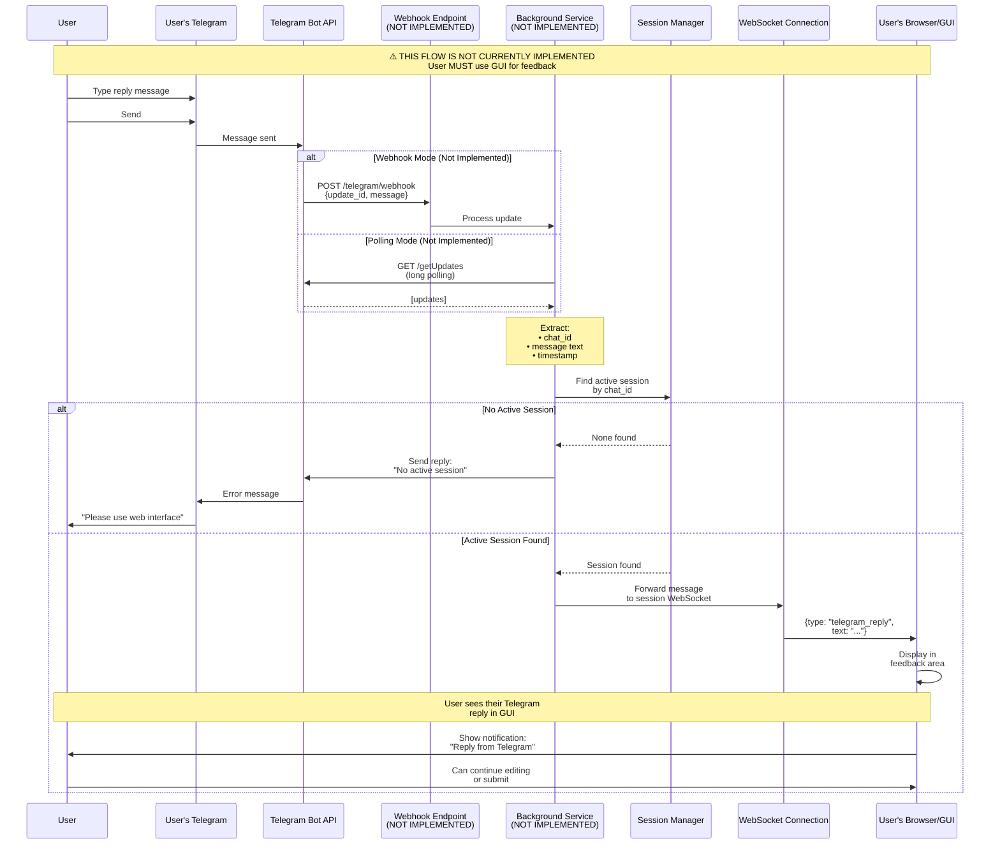

# Telegram Integration Flow Analysis
## Extended Sequential Thinking: MCP Feedback Enhanced

**Analysis Date:** October 5, 2025  
**Purpose:** Comprehensive flow analysis of Telegram integration in MCP Feedback Enhanced

---

## Overview

The MCP Feedback Enhanced system has **three distinct Telegram flows**:

1. **Test Message Flow** - GUI → Telegram API → User's Telegram chat
2. **MCP Tool Notification Flow** - AI calls tool → Telegram + GUI notifications
3. **User Reply Flow** - User replies via Telegram → System (limited implementation)

---

## Flow 1: Test Message from GUI to Telegram

### Sequential Thinking Process

**User Action Sequence:**
1. User opens Web UI in browser
2. Navigates to Telegram settings/test section
3. Clicks "Test Connection" button
4. JavaScript sends HTTP POST request to backend
5. Backend validates configuration
6. Backend creates TelegramBotManager instance
7. TelegramBotManager calls Telegram Bot API
8. Telegram API delivers message to chat
9. User receives test message in Telegram app
10. Backend returns success/failure to UI
11. UI displays result to user

### Mermaid Diagram



### ASCII Diagram

```
┌─────────────────────────────────────────────────────────────────────────────┐
│                    FLOW 1: TEST MESSAGE FROM GUI TO TELEGRAM                 │
└─────────────────────────────────────────────────────────────────────────────┘

    [User]              [Web UI]           [FastAPI]          [Config]
       │                    │                   │                 │
       │ 1. Click Test      │                   │                 │
       │ Connection         │                   │                 │
       ├───────────────────>│                   │                 │
       │                    │ 2. POST           │                 │
       │                    │ /telegram/api/    │                 │
       │                    │ test-connection   │                 │
       │                    ├──────────────────>│                 │
       │                    │                   │ 3. Check if     │
       │                    │                   │ Telegram        │
       │                    │                   │ enabled         │
       │                    │                   ├────────────────>│
       │                    │                   │<────────────────┤
       │                    │                   │ True            │
       │                    │                   │                 │
       │                    │                   │ 4. Get config   │
       │                    │                   ├────────────────>│
       │                    │                   │<────────────────┤
       │                    │                   │ token + chat_id │
       │                    │                   │                 │
       
    [FastAPI]         [TelegramBotManager]      [RateLimiter]   [Telegram API]
       │                    │                          │               │
       │ 5. Create instance │                          │               │
       ├───────────────────>│                          │               │
       │ 6. test_connection │                          │               │
       ├───────────────────>│                          │               │
       │                    │ 7. Validate token        │               │
       │                    │ GET /getMe               │               │
       │                    ├─────────────────────────────────────────>│
       │                    │<─────────────────────────────────────────┤
       │                    │ Bot info (username)      │               │
       │                    │                          │               │
       │                    │ 8. Request permission    │               │
       │                    ├─────────────────────────>│               │
       │                    │<─────────────────────────┤               │
       │                    │ Permission granted       │               │
       │                    │                          │               │
       │                    │ 9. POST /sendMessage     │               │
       │                    │ (test message)           │               │
       │                    ├─────────────────────────────────────────>│
       │                    │<─────────────────────────────────────────┤
       │                    │ message_id               │               │
       
    [Telegram API]     [User's Telegram App]         [FastAPI]      [Web UI]
       │                    │                            │              │
       │ 10. Push           │                            │              │
       │ notification       │                            │              │
       ├───────────────────>│                            │              │
       │                    │ 📱 Show message           │              │
       │                    │                            │              │
       │                    │                            │ 11. Return  │
       │                    │                            │ success     │
       │                    │                            ├─────────────>│
       │                    │                            │              │
       │                    │                            │ 12. Display │
       │                    │                            │ ✅ Success  │
       │                    │                            │<─────────────┤
                                                                        [User]

═══════════════════════════════════════════════════════════════════════════════
Key Components:
  • telegram_routes.py: /telegram/api/test-connection endpoint
  • config_manager.py: Configuration validation and retrieval
  • telegram_manager.py: TelegramBotManager class with test_connection() method
  • Rate limiting: 30 requests per 60 seconds
  • Telegram Bot API: Official Telegram HTTP API
═══════════════════════════════════════════════════════════════════════════════
```

---

## Flow 2: MCP Tool Call → Telegram + GUI Notification

### Sequential Thinking Process

**MCP Tool Call Sequence:**
1. AI assistant decides to collect feedback
2. AI calls `interactive_feedback()` MCP tool with summary
3. MCP server (server.py) receives call
4. Server logs tool call start (logging_middleware)
5. Server creates unique session ID
6. Server checks Telegram configuration
7. **Parallel operations begin:**
   - **Branch A: Telegram Notification**
     - Calls `send_telegram_notification()`
     - TelegramBotManager formats message
     - Applies rate limiting
     - Sends to Telegram API
     - User receives notification on phone
   - **Branch B: GUI Launch**
     - Detects environment (local/remote/WSL)
     - Launches Web UI or Desktop app
     - Creates WebSocket connection
     - Displays AI summary in UI
8. User interacts with GUI (not Telegram)
9. User provides feedback via GUI
10. WebSocket sends feedback to server
11. Server processes and returns to AI
12. AI receives feedback and continues

### Mermaid Diagram



### ASCII Diagram

```
┌─────────────────────────────────────────────────────────────────────────────┐
│        FLOW 2: MCP TOOL CALL → TELEGRAM + GUI NOTIFICATION (PARALLEL)       │
└─────────────────────────────────────────────────────────────────────────────┘

[AI Assistant]          [MCP Server]           [Logging Middleware]
       │                      │                          │
       │ 1. Call MCP tool     │                          │
       │ interactive_feedback │                          │
       │ (project_dir,        │                          │
       │  summary,            │                          │
       │  timeout=600)        │                          │
       ├─────────────────────>│                          │
       │                      │ 2. Log start             │
       │                      ├─────────────────────────>│
       │                      │ 3. Generate session_id   │
       │                      │ "mcp_session_1234"       │
       │                      │                          │
       │                      │ 4. Log session start     │
       │                      ├─────────────────────────>│
       │                      │                          │
       │                      │ 5. Detect environment    │
       │                      │ (local/SSH/WSL)          │
       │                      │                          │

┌──────────────────────────────────────────────────────────────────────────────┐
│                      🔀 PARALLEL OPERATIONS BEGIN                             │
└──────────────────────────────────────────────────────────────────────────────┘

        ┌─────────────────────────────────┬──────────────────────────────────┐
        │     BRANCH A: TELEGRAM          │      BRANCH B: GUI LAUNCH        │
        │         NOTIFICATION            │                                   │
        └─────────────────────────────────┴──────────────────────────────────┘

[MCP Server]  [Config]  [TelegramBotMgr]      [MCP Server]    [WebUI Manager]
    │             │            │                    │                │
    │ 6a. Check   │            │                    │ 6b. Launch UI  │
    │ Telegram    │            │                    ├───────────────>│
    │ enabled     │            │                    │                │
    ├────────────>│            │                    │                │ 7b. Start
    │<────────────┤            │                    │                │ FastAPI
    │ True        │            │                    │                │ server
    │             │            │                    │                │
    │ 7a. Get     │            │                    │                │ 8b. Find
    │ config      │            │                    │                │ free port
    ├────────────>│            │                    │                │ (8765+)
    │<────────────┤            │                    │                │
    │ token+      │            │                    │                │ 9b. Create
    │ chat_id     │            │                    │                │ session
    │             │            │                    │                │
    │ 8a. Send    │            │                    │                │
    │ notification│            │                    │                │
    ├────────────────────────>│                    │                │
    │             │            │                    │                │
    │             │            │ 9a. Format msg     │                │
    │             │            │ "🔔 New Feedback   │                │
    │             │            │  Request"          │                │
    │             │            │                    │                │

[TelegramBotMgr]  [RateLimit]  [Telegram API]    [WebUI Mgr]      [Browser]
    │                  │              │               │                 │
    │ 10a. Request     │              │               │ 10b. Detect     │
    │ permission       │              │               │ environment     │
    ├─────────────────>│              │               │ mode            │
    │<─────────────────┤              │               │                 │
    │ Granted          │              │               │ 11b. Open       │
    │                  │              │               │ browser         │
    │ 11a. POST        │              │               ├────────────────>│
    │ /sendMessage     │              │               │                 │
    ├─────────────────────────────────>│              │                 │
    │<─────────────────────────────────┤              │                 │
    │ message_id       │              │               │                 │
    │                  │              │               │                 │

[Telegram API] [User's Telegram]  [MCP Server]    [Browser]       [WebUI]
    │                 │                │               │               │
    │ 12a. Push       │                │               │ 12b. GET /    │
    │ notification    │                │               ├──────────────>│
    ├────────────────>│                │               │<──────────────┤
    │                 │                │               │ HTML page     │
    │                 │ 13a. Display   │               │               │
    │                 │ 📱 "New        │               │ 13b. WebSocket│
    │                 │ feedback"      │               │ connect       │
    │                 │                │               ├──────────────>│
    │<────────────────┤                │               │<──────────────┤
    │ Success         │                │               │ Connected     │
    ├─────────────────────────────────>│               │               │
    │                 │                │               │               │

┌──────────────────────────────────────────────────────────────────────────────┐
│                      🔀 PARALLEL OPERATIONS COMPLETE                          │
│                   ✅ Telegram notified  ✅ GUI displayed                      │
└──────────────────────────────────────────────────────────────────────────────┘

    [Browser]           [User]          [Browser]        [WebUI]
       │                  │                 │               │
       │ 14. Display UI   │                 │               │
       │ • AI summary     │                 │               │
       │ • Input field    │                 │               │
       │ • Image upload   │                 │               │
       │ • Command exec   │                 │               │
       ├─────────────────>│                 │               │
       │                  │                 │               │
       │                  │ 15. Interact    │               │
       │                  │ Type feedback   │               │
       │                  │ Upload image    │               │
       │                  │ Execute command │               │
       │                  ├────────────────>│               │
       │                  │                 │               │
       │                  │ 16. Submit      │               │
       │                  ├────────────────>│               │
       │                  │                 │ 17. WebSocket │
       │                  │                 │ feedback_data │
       │                  │                 ├──────────────>│

    [WebUI]           [MCP Server]      [Logging]       [AI Assistant]
       │                  │                 │                 │
       │ 18. Process      │                 │                 │
       │ images, create   │                 │                 │
       │ temp files       │                 │                 │
       │                  │                 │                 │
       │ 19. Return       │                 │                 │
       │ feedback_data    │                 │                 │
       ├─────────────────>│                 │                 │
       │                  │ 20. Create      │                 │
       │                  │ TextContent +   │                 │
       │                  │ Image objects   │                 │
       │                  │                 │                 │
       │                  │ 21. Log success │                 │
       │                  ├────────────────>│                 │
       │                  │                 │                 │
       │                  │ 22. Return      │                 │
       │                  │ feedback list   │                 │
       │                  ├─────────────────────────────────>│
       │                  │                 │                 │
       │                  │                 │                 │ 23. Process
       │                  │                 │                 │ feedback &
       │                  │                 │                 │ adjust behavior

═══════════════════════════════════════════════════════════════════════════════
Key Points:
  • Telegram notification is ONE-WAY: MCP → Telegram (no reply handling)
  • GUI is the PRIMARY interaction method (two-way)
  • Telegram serves as a PASSIVE notification/alert system
  • User must interact with GUI to provide feedback
  • Parallel operations ensure neither blocks the other
═══════════════════════════════════════════════════════════════════════════════
```

---

## Flow 3: User Reply via Telegram (Limited Implementation)

### Sequential Thinking Process

**Current Implementation Status:**
1. User receives notification in Telegram
2. User replies in Telegram chat
3. **⚠️ CRITICAL LIMITATION:** Reply is NOT automatically processed
4. System has `get_updates()` method in TelegramBotManager
5. System has message chunking for replies
6. **BUT:** No active polling/webhook listener in current architecture
7. **BUT:** No correlation between Telegram replies and active MCP sessions
8. **Result:** User MUST use GUI to provide feedback

**Why This Limitation Exists:**
- MCP server runs only during feedback collection (not persistent)
- WebSocket already provides real-time communication with GUI
- Telegram replies would require:
  - Persistent background service
  - Webhook endpoint or polling loop
  - Session correlation logic
  - Message routing to active sessions

**Potential Implementation (NOT CURRENTLY ACTIVE):**

If user replies were to be supported, the flow would be:

1. User replies in Telegram
2. Telegram sends update to webhook/polling endpoint
3. Background service receives update
4. Service extracts message content
5. Service correlates with active session (by chat_id + timestamp)
6. Service forwards to WebUI via WebSocket
7. WebUI displays Telegram reply in feedback area
8. User in GUI can see their own Telegram message
9. Submit triggers normal feedback flow

### Mermaid Diagram (Hypothetical/Future Implementation)



### ASCII Diagram (Current Reality)

```
┌─────────────────────────────────────────────────────────────────────────────┐
│         FLOW 3: USER REPLY VIA TELEGRAM (NOT CURRENTLY IMPLEMENTED)          │
│                                                                               │
│                    ⚠️  LIMITATION: ONE-WAY COMMUNICATION ONLY                 │
└─────────────────────────────────────────────────────────────────────────────┘

                        WHAT CURRENTLY HAPPENS:
                        ───────────────────────

    [User's Telegram]              [Telegram Bot]              [MCP Server]
           │                              │                          │
           │ 1. User receives             │                          │
           │ notification:                │                          │
           │ "🔔 New Feedback Request"    │                          │
           │                              │                          │
           │ 2. User types reply:         │                          │
           │ "Looks good!"                │                          │
           │                              │                          │
           │ 3. Message sent to bot       │                          │
           ├─────────────────────────────>│                          │
           │                              │                          │
           │                              │ 4. Bot receives message  │
           │                              │ (stored in Telegram's    │
           │                              │  server, waiting for     │
           │                              │  getUpdates() call)      │
           │                              │                          │
           │                              │   ❌ NO ACTIVE LISTENER  │
           │                              │   ❌ NO WEBHOOK          │
           │                              │   ❌ NO POLLING          │
           │                              │                          │
           │                              │                          │ ⚠️ MCP
           │                              │                          │ Server
           │                              │                          │ doesn't
           │                              │                          │ check
           │                              │                          │ for
           │                              │                          │ updates
           │                              │                          │
           │ 5. User waits...             │                          │
           │ ⏰ No response                │                          │
           │                              │                          │
           │ 6. User realizes reply       │                          │
           │ not processed                │                          │
           │                              │                          │
           │ 7. User opens GUI            │                          │
           │ and provides feedback        │                          │
           │ there instead                │                          │
           │                              │                          │


                       WHY THIS LIMITATION EXISTS:
                       ───────────────────────────

┌──────────────────────────────────────────────────────────────────────────────┐
│ 1. MCP Server Lifecycle:                                                     │
│    • MCP server only runs during `interactive_feedback()` call               │
│    • Not a persistent background service                                     │
│    • Exits after feedback is collected or timeout                            │
│                                                                               │
│ 2. No Message Router:                                                        │
│    • No component actively polling Telegram API for updates                  │
│    • No webhook endpoint registered with Telegram                            │
│    • TelegramBotManager.get_updates() exists but never called                │
│                                                                               │
│ 3. Session Correlation Challenge:                                            │
│    • How to match Telegram reply to specific MCP session?                    │
│    • Multiple sessions could exist (different projects)                      │
│    • No unique identifier shared between Telegram chat and MCP session       │
│                                                                               │
│ 4. Architecture Design:                                                      │
│    • GUI (WebSocket) is PRIMARY feedback channel                             │
│    • Telegram is SECONDARY notification-only channel                         │
│    • Adding bidirectional Telegram would complicate architecture             │
│                                                                               │
│ 5. User Experience Choice:                                                   │
│    • Rich feedback requires: images, commands, file uploads                  │
│    • Telegram UI less suitable for complex interactions                      │
│    • GUI provides better UX for detailed feedback                            │
└──────────────────────────────────────────────────────────────────────────────┘


              WHAT WOULD BE NEEDED FOR BIDIRECTIONAL SUPPORT:
              ────────────────────────────────────────────────

┌──────────────────────────────────────────────────────────────────────────────┐
│ Component 1: Persistent Background Service                                   │
│ ┌──────────────────────────────────────────────────────────────────────────┐ │
│ │  • Run independently of MCP server                                       │ │
│ │  • Start on system boot / IDE startup                                    │ │
│ │  • Maintain connection to Telegram API                                   │ │
│ │  • Option A: Webhook receiver (requires public endpoint)                 │ │
│ │  • Option B: Long polling loop (simpler, works locally)                  │ │
│ └──────────────────────────────────────────────────────────────────────────┘ │
│                                                                               │
│ Component 2: Session Registry                                                │
│ ┌──────────────────────────────────────────────────────────────────────────┐ │
│ │  • Track active MCP sessions                                             │ │
│ │  • Map chat_id → session_id → WebSocket connection                       │ │
│ │  • Store session metadata (project_dir, start_time)                      │ │
│ │  • Clean up expired sessions                                             │ │
│ └──────────────────────────────────────────────────────────────────────────┘ │
│                                                                               │
│ Component 3: Message Router                                                  │
│ ┌──────────────────────────────────────────────────────────────────────────┐ │
│ │  • Receive Telegram updates                                              │ │
│ │  • Extract chat_id and message content                                   │ │
│ │  • Look up active session for chat_id                                    │ │
│ │  • Forward message to session's WebSocket                                │ │
│ │  • Handle errors (no session, invalid message, etc.)                     │ │
│ └──────────────────────────────────────────────────────────────────────────┘ │
│                                                                               │
│ Component 4: WebSocket Extension                                             │
│ ┌──────────────────────────────────────────────────────────────────────────┐ │
│ │  • New message type: "telegram_reply"                                    │ │
│ │  • GUI displays Telegram messages in feedback area                       │ │
│ │  • User can see their own Telegram replies in real-time                  │ │
│ │  • Optional: Allow sending replies back to Telegram from GUI             │ │
│ └──────────────────────────────────────────────────────────────────────────┘ │
└──────────────────────────────────────────────────────────────────────────────┘


                         CURRENT WORKAROUND:
                         ───────────────────

    User receives Telegram notification
              ↓
    User opens GUI on computer
              ↓
    User provides feedback in GUI
              ↓
    MCP receives feedback via WebSocket
              ↓
    ✅ Process completes successfully

═══════════════════════════════════════════════════════════════════════════════
SUMMARY:
  ✅ Telegram notifications work (one-way: MCP → Telegram)
  ❌ Telegram replies don't work (no listener: Telegram → MCP)
  ✅ GUI feedback works perfectly (bidirectional via WebSocket)
  
  Telegram purpose: Alert user on mobile that feedback is needed
  GUI purpose: Actual feedback collection with rich features
═══════════════════════════════════════════════════════════════════════════════
```

---

## Key Code References

### Flow 1: Test Message

**File:** `src/mcp_feedback_enhanced/web/routes/telegram_routes.py`
```python
@router.post("/api/test-connection")
async def test_telegram_connection():
    # Get config
    config = get_telegram_config()
    
    # Test connection using TelegramBotManager
    async with TelegramBotManager(config.bot_token, config.chat_id) as bot:
        success, message = await bot.test_connection()
    
    return JSONResponse({"success": success, "message": message})
```

**File:** `src/mcp_feedback_enhanced/utils/telegram_manager.py`
```python
async def test_connection(self) -> Tuple[bool, str]:
    # Test bot info
    url = f"{self.api_base_url}/getMe"
    async with self.session.get(url) as response:
        result = await response.json()
    
    # Send test message
    test_message = f"🤖 Connection test successful!\nBot: @{bot_username}"
    message_result = await self.send_message(test_message, parse_mode=None)
    
    return (True, "Connection successful!") if message_result else (False, "Failed")
```

### Flow 2: MCP Tool Notification

**File:** `src/mcp_feedback_enhanced/server.py`
```python
@mcp.tool()
async def interactive_feedback(
    project_directory: str = ".",
    summary: str = "I've completed your task.",
    timeout: int = 600,
    message_type: str = "general",
) -> list:
    # Generate session ID
    session_id = f"mcp_session_{int(time.time())}"
    
    # Send Telegram notification (parallel with GUI launch)
    telegram_notification_sent = False
    try:
        telegram_notification_sent = await send_telegram_notification(
            summary, project_directory
        )
    except Exception as e:
        debug_log(f"Telegram notification failed: {e}")
    
    # Launch Web UI (parallel with Telegram)
    result = await launch_web_feedback_ui(
        project_directory, summary, timeout, message_type
    )
    
    # Process feedback and return
    return feedback_items
```

**File:** `src/mcp_feedback_enhanced/utils/telegram_manager.py`
```python
async def send_telegram_notification(summary: str, project_directory: str) -> bool:
    # Check configuration
    if not is_telegram_enabled():
        return False
    
    config = get_telegram_config()
    
    # Format notification message
    message = format_feedback_notification(summary, project_directory)
    
    # Send via TelegramBotManager
    async with TelegramBotManager(config.bot_token, config.chat_id) as bot:
        result = await bot.send_message(message, parse_mode="Markdown")
    
    return bool(result)
```

### Flow 3: User Reply (Not Implemented)

**File:** `src/mcp_feedback_enhanced/utils/telegram_manager.py`
```python
async def get_updates(self, offset: Optional[int] = None, timeout: int = 30):
    """
    Get updates from Telegram using long polling.
    
    ⚠️ NOTE: This method exists but is NEVER CALLED in current architecture.
    It would need to be called by a persistent background service.
    """
    url = f"{self.api_base_url}/getUpdates"
    params = {"timeout": timeout, "allowed_updates": ["message"]}
    
    if offset is not None:
        params["offset"] = offset
    
    async with self.session.get(url, params=params) as response:
        result = await response.json()
        return result.get("result", [])
```

---

## Summary Table

| Flow | Direction | Status | Purpose | Implementation |
|------|-----------|--------|---------|----------------|
| **Test Message** | GUI → Telegram | ✅ Working | Test bot connection | HTTP POST → TelegramBotManager → Telegram API |
| **MCP Notification** | MCP → Telegram + GUI | ✅ Working | Alert user of feedback request | Parallel: send_telegram_notification() + launch_web_feedback_ui() |
| **User Reply** | Telegram → MCP/GUI | ❌ Not Working | Process Telegram replies | Would need: background service + polling/webhook + session correlation |

---

## Architecture Decision

The current architecture makes a **deliberate choice**:

**Telegram = Notification Channel (One-Way)**
- Simple, reliable, no additional complexity
- User gets alerted on mobile device
- No persistent services required
- No session correlation challenges

**GUI = Interaction Channel (Two-Way)**
- Rich features: images, commands, file uploads
- Real-time WebSocket communication
- Better UX for detailed feedback
- Direct integration with MCP server

**Result:** User receives mobile notification, then uses computer to provide feedback via GUI.

This design trades bidirectional Telegram support for architectural simplicity and better user experience for complex feedback scenarios.

---

## Potential Future Enhancement

If bidirectional Telegram support is desired, the implementation would require:

1. **Background Service**: Separate process running independently of MCP server
2. **Polling/Webhook**: Active listener for Telegram updates
3. **Session Registry**: Shared state between background service and MCP server
4. **Message Router**: Forward Telegram messages to appropriate WebSocket connections
5. **Error Handling**: Deal with session expiry, invalid messages, etc.

**Complexity Level:** High  
**Benefit:** Moderate (convenience vs. existing GUI workflow)  
**Recommendation:** Current one-way design is pragmatic and sufficient for most use cases.

---

**End of Flow Analysis**
