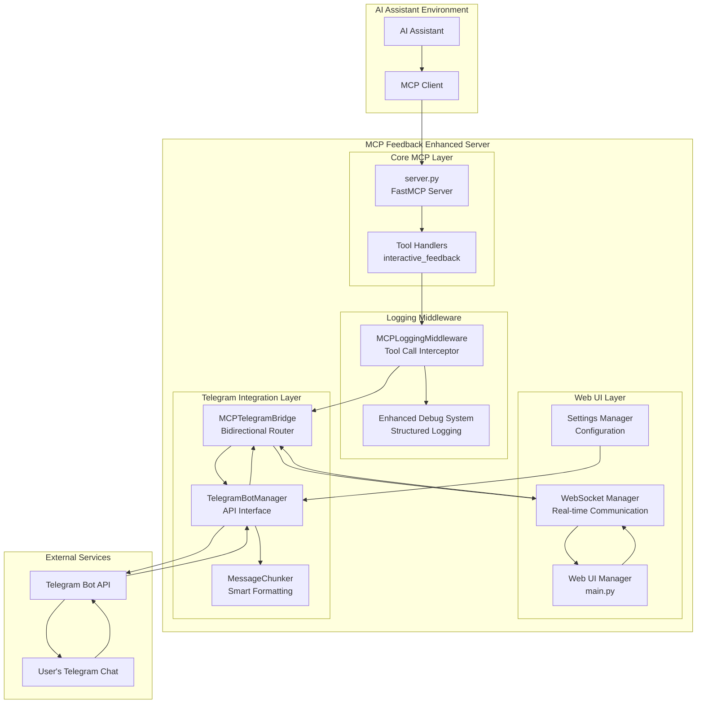
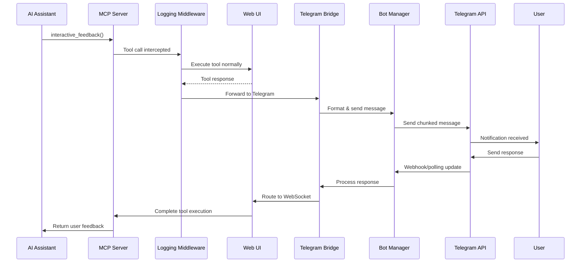
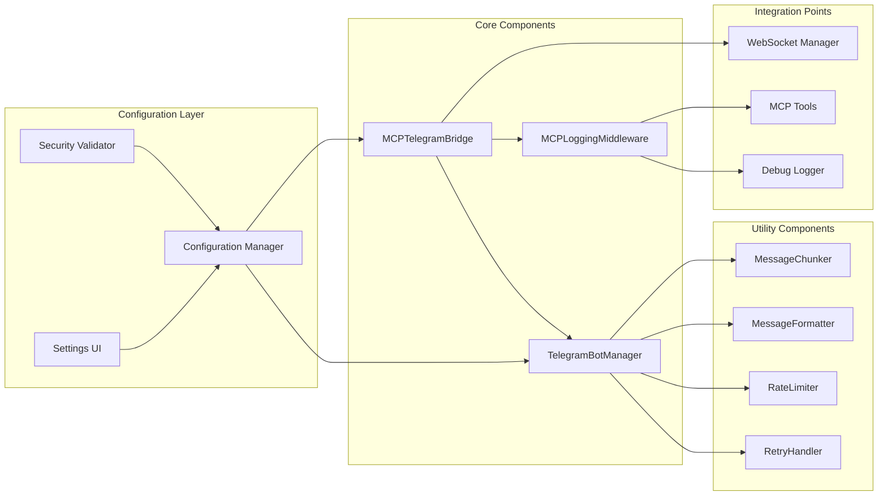
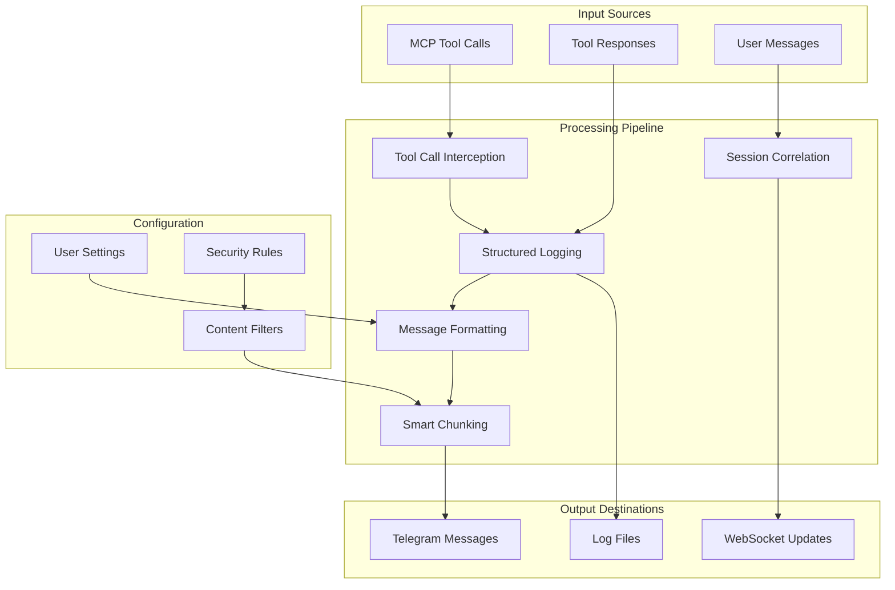
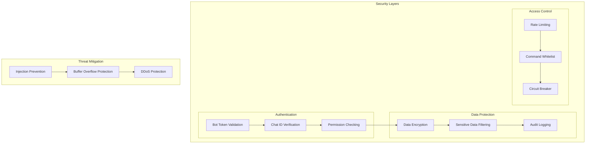
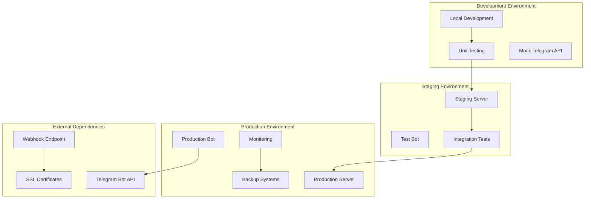
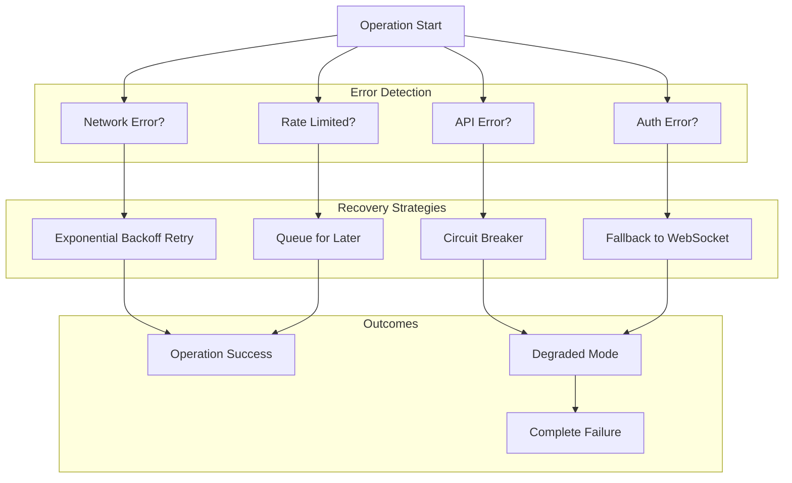

# Telegram Integration Architecture Diagrams

## System Overview Diagram

## Message Flow Diagram

## Component Interaction Diagram

## Data Flow Architecture

## Security Architecture

## Deployment Architecture

## Error Handling Flow

